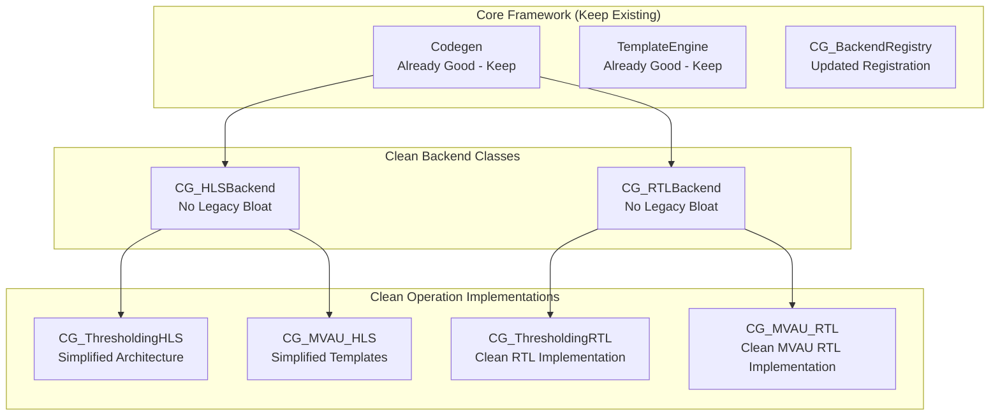

# FINN Codegen Clean Refactor Implementation Plan

## Overview

This plan addresses the compatibility bloat and mixed paradigms identified in the FINN universal codegen refactor by creating clean, parallel implementations of compromised files. The approach uses `CG_` prefixed files to develop and validate the clean architecture alongside the existing system.

## Architecture Goals

### Core Principles
1. **Single Paradigm**: Only Jinja2-based template system, no legacy compatibility
2. **Explicit Template Declaration**: Simple, clear template selection
3. **Direct Value Generation**: No `code_gen_dict` conversion layers
4. **Maintain Current Inheritance**: Keep existing inheritance structure for compatibility
5. **Common Functionality Extraction**: Shared code in base classes

### Target Architecture



## Implementation Plan

### Phase 1: Clean Backend Registry

#### 1.1 Clean Backend Registry (`CG_BackendRegistry`)
**File**: `src/finn/codegen/CG_backend_registration.py`

**Improvements**:
- Register clean implementations alongside legacy ones
- Support A/B testing between old and new backends
- Configuration-driven backend selection

**Note**: Keep existing `codegen.py` and `template_engine.py` as they are already well-implemented

### Phase 2: Clean Backend Implementations

#### 2.1 Clean HLS Backend (`CG_HLSBackend`)
**File**: `src/finn/custom_op/fpgadataflow/CG_hlsbackend.py`

**Key Changes**:
- **Remove Entirely**: All `code_gen_dict` usage and legacy methods
- **Standardize**: Template value generation through direct methods
- **Simplify**: Template selection to explicit declarations
- **Extract**: Common HLS functionality

```python
class CG_HLSBackend(Codegen):
    """Clean HLS backend without legacy compatibility."""
    
    def get_template_values(self, template_name: str) -> Dict[str, Any]:
        """Generate template values directly - no legacy conversion."""
        values = self._generate_common_values()
        values.update(self._generate_hls_common_values())
        values.update(self._generate_operation_specific_values(template_name))
        return self._validate_template_values(values)
    
    def _generate_hls_common_values(self) -> Dict[str, Any]:
        """Generate values common to all HLS operations."""
        return {
            'AP_INT_MAX_W': self._calculate_ap_int_max_w(),
            'INCLUDES': self._generate_hls_includes(),
            'PRAGMAS': self._generate_hls_pragmas(),
            'STREAM_DECLARATIONS': self._generate_stream_declarations(),
        }
    
    def _generate_hls_includes(self) -> str:
        """Generate HLS includes directly."""
        includes = [
            '#include "hls_stream.h"',
            '#include "ap_int.h"',
            '#include "bnn-library.h"'
        ]
        return '\n'.join(includes)
    
    def _generate_hls_pragmas(self) -> str:
        """Generate HLS pragmas directly."""
        pragmas = [
            '#pragma HLS INTERFACE axis port=in0_V',
            '#pragma HLS INTERFACE axis port=out0_V',
            '#pragma HLS INTERFACE ap_ctrl_none port=return'
        ]
        return '\n'.join(pragmas)
    
    # Remove ALL legacy methods:
    # - code_generation_cppsim() 
    # - code_generation_ipgen()
    # - global_includes()
    # - defines()
    # - docompute()
    # - All _get_*_from_code_gen_dict() methods
```

#### 2.2 Clean RTL Backend (`CG_RTLBackend`)
**File**: `src/finn/custom_op/fpgadataflow/CG_rtlbackend.py`

**Key Changes**:
- Remove legacy compatibility methods
- Standardize RTL template value generation
- Simplify module naming and interface generation

```python
class CG_RTLBackend(Codegen):
    """Clean RTL backend without legacy compatibility."""
    
    def _generate_rtl_common_values(self) -> Dict[str, Any]:
        """Generate values common to all RTL operations."""
        return {
            'MODULE_NAME': self._generate_module_name(),
            'CLK_SIGNAL': 'clk',
            'RST_SIGNAL': 'rst_n',
            'DATA_WIDTH': self._extract_data_width(),
            'INTERFACE_TYPE': 'axi_stream',
        }
    
    def _generate_module_name(self) -> str:
        """Generate clean module name."""
        return f"{self.onnx_node.name}_{self.onnx_node.op_type.lower()}"
```

### Phase 3: Clean Operation Implementations

#### 3.1 Clean Thresholding HLS (`CG_ThresholdingHLS`)
**File**: `src/finn/custom_op/fpgadataflow/hls/CG_thresholding_hls.py`

**Approach**: Maintain existing inheritance structure but clean implementation
```python
class CG_ThresholdingHLS(Thresholding, CG_HLSBackend):
    """Clean thresholding HLS implementation with current inheritance."""
    
    TEMPLATE_NAME = "thresholding/hls/docompute.cpp.j2"
    TEMPLATE_FALLBACKS = ["hls/docompute.cpp.j2"]
    
    def __init__(self, onnx_node, **kwargs):
        # Maintain current inheritance structure
        Thresholding.__init__(self, onnx_node, **kwargs)
        CG_HLSBackend.__init__(self)
    
    def _generate_operation_specific_values(self, template_name: str) -> Dict[str, Any]:
        """Generate thresholding-specific template values."""
        return {
            'DEFINES': self._generate_thresholding_defines(),
            'DOCOMPUTE': self._generate_thresholding_compute(),
            'READNPYDATA': self._generate_read_npy_data(),
            'DATAOUTSTREAM': self._generate_data_out_stream(),
        }
    
    def _generate_thresholding_defines(self) -> str:
        """Generate thresholding defines directly."""
        defines = [
            f"#define NumChannels1 {self.get_nodeattr('NumChannels')}",
            f"#define PE1 {self.get_nodeattr('PE')}",
            f"#define numReps {self.get_nodeattr('numInputVectors')[0]}"
        ]
        return '\n'.join(defines)
```

#### 3.2 Simplified MVAU HLS (`CG_MVAU_HLS`)
**File**: `src/finn/custom_op/fpgadataflow/hls/CG_mvau_hls.py`

**Key Simplifications**:
- Single template instead of 15+ options
- Remove complex template selection logic
- Focus on most common use case
- Maintain existing inheritance structure

```python
class CG_MVAU_HLS(MatrixVectorActivation, CG_HLSBackend):
    """Simplified MVAU HLS implementation with current inheritance."""
    
    TEMPLATE_NAME = "mvau/hls/streaming.cpp.j2"
    TEMPLATE_FALLBACKS = ["hls/mvau_streaming.cpp.j2"]
    
    def __init__(self, onnx_node, **kwargs):
        # Maintain current inheritance structure
        MatrixVectorActivation.__init__(self, onnx_node, **kwargs)
        CG_HLSBackend.__init__(self)
    
    def _generate_operation_specific_values(self, template_name: str) -> Dict[str, Any]:
        """Generate MVAU-specific values - simplified approach."""
        return {
            'DEFINES': self._generate_mvau_defines(),
            'DOCOMPUTE': self._generate_mvau_compute(),
            'WEIGHT_MEMORY': self._generate_weight_memory_config(),
        }
    
    def _generate_mvau_defines(self) -> str:
        """Generate MVAU defines directly."""
        defines = [
            f"#define PE {self.get_nodeattr('PE')}",
            f"#define SIMD {self.get_nodeattr('SIMD')}",
            f"#define MW {self.get_nodeattr('MW')}",
            f"#define MH {self.get_nodeattr('MH')}"
        ]
        return '\n'.join(defines)
```

#### 3.3 Clean Thresholding RTL (`CG_ThresholdingRTL`)
**File**: `src/finn/custom_op/fpgadataflow/rtl/CG_thresholding_rtl.py`

**New Implementation**: Clean RTL backend for thresholding with current inheritance
```python
class CG_ThresholdingRTL(Thresholding, CG_RTLBackend):
    """Clean thresholding RTL implementation with current inheritance."""
    
    TEMPLATE_NAME = "thresholding/rtl/wrapper.v.j2"
    
    def __init__(self, onnx_node, **kwargs):
        # Maintain current inheritance structure
        Thresholding.__init__(self, onnx_node, **kwargs)
        CG_RTLBackend.__init__(self)
    
    def _generate_operation_specific_values(self, template_name: str) -> Dict[str, Any]:
        """Generate thresholding RTL values."""
        return {
            'N_STEPS': self.get_nodeattr('NumSteps'),
            'INPUT_WIDTH': self.get_input_datatype().bitwidth(),
            'OUTPUT_WIDTH': self.get_output_datatype().bitwidth(),
            'PE_COUNT': self.get_nodeattr('PE'),
            'THRESHOLD_CONFIG': self._generate_threshold_config(),
        }
```

#### 3.4 Clean MVAU RTL (`CG_MVAU_RTL`)
**File**: `src/finn/custom_op/fpgadataflow/rtl/CG_mvau_rtl.py`

**New Implementation**: Clean RTL backend for MVAU with current inheritance
```python
class CG_MVAU_RTL(MatrixVectorActivation, CG_RTLBackend):
    """Clean MVAU RTL implementation with current inheritance."""
    
    TEMPLATE_NAME = "mvau/rtl/wrapper.v.j2"
    TEMPLATE_FALLBACKS = ["rtl/mvau_wrapper.v.j2"]
    
    def __init__(self, onnx_node, **kwargs):
        # Maintain current inheritance structure
        MatrixVectorActivation.__init__(self, onnx_node, **kwargs)
        CG_RTLBackend.__init__(self)
    
    def _generate_operation_specific_values(self, template_name: str) -> Dict[str, Any]:
        """Generate MVAU RTL values."""
        return {
            'PE_COUNT': self.get_nodeattr('PE'),
            'SIMD_COUNT': self.get_nodeattr('SIMD'),
            'MATRIX_WIDTH': self.get_nodeattr('MW'),
            'MATRIX_HEIGHT': self.get_nodeattr('MH'),
            'DATA_WIDTH': self.get_input_datatype().bitwidth(),
            'WEIGHT_WIDTH': self.get_weight_datatype().bitwidth(),
            'MEMORY_CONFIG': self._generate_memory_interface(),
        }
    
    def _generate_memory_interface(self) -> str:
        """Generate memory interface configuration for MVAU RTL."""
        mem_mode = self.get_nodeattr('mem_mode')
        if mem_mode == 'const':
            return 'EMBEDDED_WEIGHTS'
        elif mem_mode == 'decoupled':
            return 'EXTERNAL_MEMORY'
        else:
            return 'STREAMING_WEIGHTS'
```

### Phase 4: Template Consolidation

#### 5.1 Template Cleanup
- **Remove duplicate templates**: Consolidate similar templates
- **Standardize template structure**: Consistent placeholder naming
- **Add template validation**: Ensure all placeholders are provided

#### 5.2 New Template Structure
```
src/finn/codegen/templates/
├── hls/
│   ├── base/
│   │   ├── docompute.cpp.j2
│   │   ├── ipgen.cpp.j2
│   │   └── ipgen.tcl.j2
│   ├── thresholding/
│   │   ├── docompute.cpp.j2
│   │   └── ipgen.cpp.j2
│   └── mvau/
│       ├── streaming.cpp.j2
│       └── ipgen.cpp.j2
└── rtl/
    ├── base/
    │   └── wrapper.v.j2
    ├── thresholding/
    │   └── wrapper.v.j2
    └── mvau/
        └── wrapper.v.j2
```

### Phase 6: Legacy Cleanup Phase

#### 6.1 Remove Legacy Bloat from Existing Files
After validating the clean implementations, remove all legacy artifacts from the original files:

**Files to Clean Up**:
- `src/finn/custom_op/fpgadataflow/hlsbackend.py`
- `src/finn/custom_op/fpgadataflow/rtlbackend.py`
- `src/finn/custom_op/fpgadataflow/hls/thresholding_hls.py`
- `src/finn/custom_op/fpgadataflow/hls/mvau_hls.py`

**Removal Targets**:
```python
# Remove ALL of these from existing files:
- code_gen_dict usage entirely
- All _get_*_from_code_gen_dict() methods
- Legacy methods: global_includes(), defines(), docompute()
- code_generation_cppsim() legacy implementations
- code_generation_ipgen() legacy implementations
- All string replacement template logic
- Complex template selection mechanisms
- Multiple inheritance complexity
```

**Standardization**:
- Replace with direct template value generation
- Use explicit template declarations
- Implement composition over inheritance
- Add proper error handling and validation

## Validation Strategy

### Phase 7: A/B Testing Framework

#### 6.1 Parallel Execution Framework
Create a testing framework that can run both old and new implementations:

```python
class CodegenValidator:
    """Framework for validating new implementations against old ones."""
    
    def validate_backend(self, operation_name: str, backend_type: str):
        """Run both old and new backends, compare outputs."""
        old_backend = self._get_legacy_backend(operation_name, backend_type)
        new_backend = self._get_clean_backend(operation_name, backend_type)
        
        old_output = old_backend.generate_code()
        new_output = new_backend.generate_code()
        
        return self._compare_outputs(old_output, new_output)
```

#### 6.2 Output Comparison
- **Functional equivalence**: Generated code produces same results
- **Performance comparison**: Template rendering speed
- **Code quality metrics**: Line count, complexity measures

### Phase 8: Migration Strategy

#### 7.1 Gradual Migration Plan
1. **Parallel Development**: Develop clean implementations alongside old ones
2. **Validation**: Extensive testing of clean implementations
3. **Feature Parity**: Ensure clean implementations match old functionality
4. **Switch Over**: Replace old implementations with clean ones
5. **Cleanup**: Remove old files and restore clean ones

#### 7.2 Git Strategy
```bash
# Create clean implementations
git add src/finn/codegen/CG_*.py
git add src/finn/custom_op/fpgadataflow/CG_*.py
git commit -m "Add clean codegen implementations"

# After validation, restore originals and replace
git restore src/finn/custom_op/fpgadataflow/hlsbackend.py
git restore src/finn/custom_op/fpgadataflow/rtlbackend.py
# ... restore other files

# Move clean implementations to replace originals
git mv src/finn/codegen/CG_codegen.py src/finn/codegen/codegen.py
# ... move other files

git commit -m "Replace legacy implementations with clean ones"
```

## Success Metrics

### Quantitative Goals
- **Reduce codebase size**: Target 30-40% reduction in backend code
- **Eliminate legacy methods**: 0 `code_gen_dict` usage
- **Template consolidation**: Reduce template count by 50%
- **Performance**: Template rendering speed improvement

### Qualitative Goals
- **Single paradigm**: Only Jinja2-based system
- **Clear architecture**: Simplified inheritance/composition
- **Maintainable code**: No compatibility bloat
- **Explicit configuration**: Clear template selection

## Implementation Timeline

| Phase | Duration | Deliverables |
|-------|----------|--------------|
| Phase 1 | 1 week | Clean backend registry |
| Phase 2 | 2 weeks | Clean backend implementations |
| Phase 3 | 2 weeks | Clean operation implementations (including CG_MVAU_RTL) |
| Phase 4 | 1 week | Template consolidation |
| Phase 5 | 1 week | Legacy cleanup - remove all bloat |
| Phase 6 | 2 weeks | Validation framework and testing |
| Phase 7 | 1 week | Migration and cleanup |

**Total**: 10 weeks for complete clean implementation and validation

## Risk Mitigation

### Technical Risks
- **Functional regressions**: Extensive A/B testing framework
- **Performance degradation**: Benchmarking and optimization
- **Template compatibility**: Validation against existing models

### Process Risks  
- **Scope creep**: Strict adherence to cleanup goals
- **Integration complexity**: Gradual migration approach
- **Resource allocation**: Parallel development without disrupting existing work

## Conclusion

This implementation plan provides a systematic approach to eliminating the compatibility bloat and mixed paradigms in the FINN universal codegen refactor. By creating clean, parallel implementations and validating them against the existing system, we can ensure a successful migration to a maintainable, single-paradigm architecture.

The plan focuses on:
1. **Complete elimination** of legacy compatibility code
2. **Standardization** of template value generation
3. **Simplification** of template selection mechanisms
4. **Maintain current inheritance structure** for compatibility
5. **Comprehensive validation** before migration

Success will result in a clean, maintainable code generation system that fully realizes the benefits of the Jinja2-based architecture without the burden of legacy compatibility.