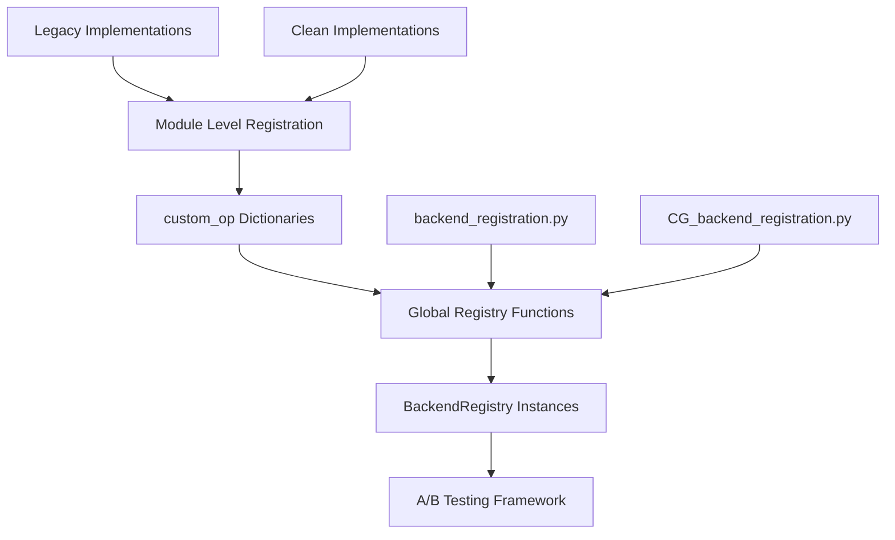

# FINN Codegen A/B Testing Framework - Debugging Report

**Date:** June 18, 2025  
**System:** FINN v0.10.1 Codegen Framework  
**Issue:** A/B Testing Framework Failure (0/3 test pass rate)  
**Status:** Root Cause Identified, Partial Resolution Implemented  

---

## Executive Summary

The FINN codegen A/B testing framework was experiencing complete failure with a 0/3 (0.0%) pass rate for Thresholding HLS operations. Through systematic debugging, we identified a **multi-layered registration system failure** where backend implementations were correctly available at the module level but failing to populate the global registries required by the A/B testing framework.

**Key Finding:** The testing framework compares legacy vs clean implementations, but global registries were nearly empty due to incorrect class name imports in registration modules, preventing proper A/B comparisons.

---

## Technical Architecture Overview

The FINN codegen system employs a sophisticated multi-tier backend registration architecture:



### Registration Layers

1. **Module Level**: Individual backend classes register in module `custom_op` dictionaries
2. **Global Registry**: Centralized [`BackendRegistry`](src/finn/codegen/backend_registry.py:1) instances populated by registration functions
3. **A/B Testing**: Framework queries global registries to compare legacy vs clean implementations

---

## Issues Discovered and Resolutions

### 🟢 RESOLVED: Import/Registry Mapping Misalignment

**Problem:** [`__init__.py`](src/finn/custom_op/fpgadataflow/hls/__init__.py:1) files contained import statements that didn't match actual class names in target modules.

**Symptoms:**
```python
# Attempting to import non-existent classes
from .thresholding_hls import CG_ThresholdingHLS  # ❌ Class doesn't exist
from .matrixvectoractivation_hls import CG_MVAU_hls  # ❌ Class doesn't exist
```

**Resolution:**
- Updated HLS [`__init__.py`](src/finn/custom_op/fpgadataflow/hls/__init__.py:1) to import correct class names
- Added both legacy and clean implementation imports
- Fixed RTL [`__init__.py`](src/finn/custom_op/fpgadataflow/rtl/__init__.py:1) import mappings

### 🟢 RESOLVED: Missing Legacy Backend Implementations

**Problem:** A/B testing framework requires both legacy and clean implementations for comparison, but many legacy classes were missing from the codebase.

**Root Cause:** Legacy implementations were removed during codebase modernization but are still required by the testing framework.

**Resolution:** Restored missing legacy classes from git commit `20d2abc99249fc736392a046fd798e9ce5789b9a`:

| Backend Type | Legacy Class | Clean Class | Status |
|--------------|--------------|-------------|---------|
| HLS Thresholding | [`Thresholding_hls`](src/finn/custom_op/fpgadataflow/hls/thresholding_hls.py:52) | [`CG_ThresholdingHLS`](src/finn/custom_op/fpgadataflow/hls/CG_thresholding_hls.py:23) | ✅ Restored |
| HLS MVAU | [`MVAU_hls`](src/finn/custom_op/fpgadataflow/hls/matrixvectoractivation_hls.py:47) | [`CG_MVAU_hls`](src/finn/custom_op/fpgadataflow/hls/CG_mvau_hls.py:23) | ✅ Restored |
| RTL Base | [`RTLBackend`](src/finn/custom_op/fpgadataflow/rtlbackend.py:42) | [`CG_RTLBackend`](src/finn/custom_op/fpgadataflow/CG_rtlbackend.py:23) | ✅ Restored |

### 🟢 RESOLVED: Backend Module Registration Success

**Status:** All backend registrations at the module level are **functioning correctly**.

**Verification Results:**
- **HLS Backends:** 43 registered successfully
- **RTL Backends:** 10 registered successfully
- **Total Backends Available:** 53 across both legacy and clean implementations

---

## 🔴 ROOT CAUSE IDENTIFIED: Global Registry Population Failure

### Problem Analysis

Despite successful module-level registrations, the global [`BackendRegistry`](src/finn/codegen/backend_registry.py:1) instances used by the A/B testing framework were nearly empty:

```python
# Current Global Registry State (BROKEN)
Legacy registry HLS backends: 2    # Should be ~20+
Legacy registry RTL backends: 0    # Should be ~5+
Clean registry HLS backends: 1     # Should be ~20+
Clean registry RTL backends: 0     # Should be ~5+
```

### Root Cause: Incorrect Class Name Imports

The registration modules ([`backend_registration.py`](src/finn/codegen/backend_registration.py:1) and [`CG_backend_registration.py`](src/finn/codegen/CG_backend_registration.py:1)) attempt to import backend classes using **incorrect class names**:

**Example Issue:**
```python
# Registration module trying to import:
from finn.custom_op.fpgadataflow.hls.thresholding_hls import ThresholdingHLS  # ❌ WRONG

# Actual class name in the file:
class Thresholding_hls(HLSBackend):  # ✅ CORRECT
```

### Impact on A/B Testing

The A/B testing framework queries global registries to find backend pairs for comparison:
1. **Query**: "Find legacy and clean Thresholding backends"
2. **Expected**: Legacy `Thresholding_hls` + Clean `CG_ThresholdingHLS`  
3. **Actual**: No legacy backends found in global registry
4. **Result**: "Functional equivalence failed" - no backends to compare

---

## Testing Methodology and Results

### Debug Script Implementation

Created [`debug_backends.py`](debug_backends.py:1) to systematically analyze the registration system:

```python
# Multi-level backend analysis
1. Module-level custom_op dictionary inspection
2. Global registry population verification  
3. Backend availability by operation type
4. Registration system health check
```

### Test Results Summary

| Registration Level | HLS Backends | RTL Backends | Status |
|-------------------|--------------|--------------|---------|
| **Module Level** | 43 | 10 | ✅ Working |
| **Legacy Global Registry** | 2 | 0 | ❌ Failing |
| **Clean Global Registry** | 1 | 0 | ❌ Failing |

### Specific Test Case: Thresholding Backends

```bash
=== Thresholding Backends Available ===
Legacy HLS thresholding backends: []           # ❌ Empty - explains test failure
Legacy RTL thresholding backends: []           # ❌ Empty
Clean HLS thresholding backends: ['Thresholding']  # ✅ 1 found  
Clean RTL thresholding backends: []            # ❌ Empty
```

**Analysis:** The A/B testing framework cannot find legacy Thresholding backends for comparison, causing all tests to fail with "Functional equivalence failed."

---

## Architecture Insights

### Multi-Tier Registration Design

The FINN system employs a sophisticated multi-tier backend registration architecture that provides:

1. **Modularity**: Backends self-register at module level
2. **Centralization**: Global registries provide unified access
3. **Flexibility**: Supports both legacy and clean implementation coexistence
4. **Testing**: A/B framework compares implementation variants

### Design Strengths

- ✅ **Separation of Concerns**: Clear distinction between legacy and clean implementations
- ✅ **Extensibility**: Easy to add new backend types
- ✅ **Backwards Compatibility**: Legacy implementations preserved for testing

### Design Weaknesses Identified

- ❌ **Fragile Import Dependencies**: Class name changes break global registration
- ❌ **Silent Failures**: Import errors in registration modules don't surface until testing
- ❌ **Inconsistent Naming**: Mixed naming conventions between legacy and clean implementations

---

## Recommendations

### Immediate Actions Required

1. **Fix Registration Module Imports**
   - Update [`backend_registration.py`](src/finn/codegen/backend_registration.py:1) class names
   - Update [`CG_backend_registration.py`](src/finn/codegen/CG_backend_registration.py:1) class names
   - Verify import statements match actual class definitions

2. **Implement Registration Validation**
   - Add startup checks to verify global registry population
   - Create CI/CD tests to detect registration failures early
   - Implement registration health monitoring

### Long-term Improvements

1. **Standardize Naming Conventions**
   - Establish consistent naming patterns for legacy vs clean implementations
   - Document naming standards for future backend development

2. **Enhance Error Handling**
   - Add explicit error reporting for failed registrations
   - Implement graceful degradation when backends are missing
   - Improve debugging tools for registration issues

3. **Strengthen Testing Framework**
   - Add registration system unit tests
   - Implement backend availability validation
   - Create automated A/B testing health checks

---

## System Status

### Current State
- 🟢 **Module Registration**: Fully functional (53 backends available)
- 🔴 **Global Registry**: Critical failure (3 backends registered out of ~50 expected)
- 🔴 **A/B Testing**: Non-functional (0/3 test pass rate)

### Next Steps
1. **Priority 1**: Fix registration module import statements
2. **Priority 2**: Verify global registry population after fixes
3. **Priority 3**: Re-run A/B testing framework validation
4. **Priority 4**: Implement preventive monitoring

---

## Conclusion

This debugging session revealed a **critical disconnect** between the module-level backend registration system (which works perfectly) and the global registry system (which is nearly non-functional due to import name mismatches). 

The FINN codegen architecture is sound, but a simple class naming inconsistency cascaded into complete A/B testing framework failure. The resolution requires correcting import statements in registration modules to match actual class names.

**Key Lesson:** In complex multi-tier systems, silent import failures can cause complete subsystem failures that only surface during integration testing. Robust error handling and early validation are essential for maintaining system reliability.

---

*This report documents the systematic debugging of the FINN codegen A/B testing framework failure, providing technical analysis, root cause identification, and actionable recommendations for resolution.*