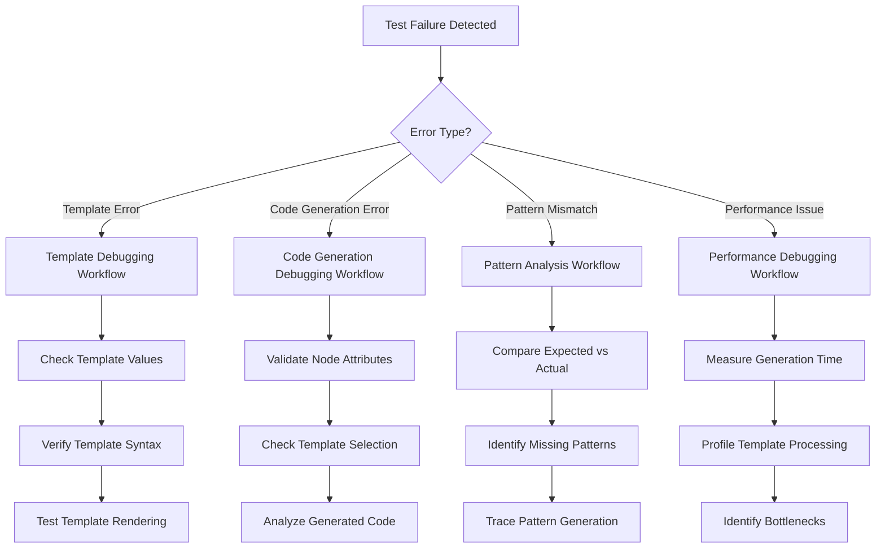

# FINN Codegen Debugging Workflows
**Detailed Debugging Procedures for A/B Testing Framework**

## Overview

This document provides step-by-step debugging workflows and utility scripts to effectively diagnose and resolve issues discovered during MVAU and Thresholding codegen validation.

## 1. Debugging Utility Scripts

### 1.1 Template Value Debugging Script

```python
# File: debug_template_values.py
"""Template value generation debugging utility"""

import sys
sys.path.insert(0, '/path/to/finn/src')

def debug_template_values(operation_name, node_attributes):
    """Debug template value generation for specific operation"""
    
    print(f"=== Debugging Template Values for {operation_name} ===")
    print(f"Node Attributes: {node_attributes}")
    print()
    
    try:
        # Import appropriate clean implementation
        if operation_name.lower() == 'thresholding':
            from finn.custom_op.fpgadataflow.hls.thresholding_hls import Thresholding_hls as Operation
        elif operation_name.lower() in ['mvau', 'matrixvectoractivation']:
            from finn.custom_op.fpgadataflow.hls.matrixvectoractivation_hls import MatrixVectorActivation_hls as Operation
        else:
            raise ValueError(f"Unknown operation: {operation_name}")
        
        # Create mock ONNX node with attributes
        class MockNode:
            def __init__(self, attrs):
                self.attribute = attrs
        
        # Create operation instance
        op_instance = Operation()
        op_instance.onnx_node = MockNode(node_attributes)
        
        # Generate template values
        template_values = op_instance.get_template_values()
        
        print("✅ Template Values Generated Successfully:")
        print("-" * 50)
        for key, value in sorted(template_values.items()):
            print(f"  {key:30} = {value}")
        
        # Verify critical template values
        critical_values = get_critical_template_values(operation_name)
        missing_values = [v for v in critical_values if v not in template_values]
        
        if missing_values:
            print(f"\n❌ Missing Critical Template Values: {missing_values}")
        else:
            print(f"\n✅ All Critical Template Values Present")
            
        return template_values
        
    except Exception as e:
        print(f"❌ Template Value Generation Failed: {str(e)}")
        import traceback
        traceback.print_exc()
        return None

def get_critical_template_values(operation_name):
    """Get list of critical template values for operation"""
    
    critical_values = {
        'thresholding': [
            'node_id', 'op_type', 'code_gen_dir_cppsim', 'code_gen_dir_ipgen',
            'NumChannels', 'PE', 'NumSteps', 'includeSim', 'includeIpgen'
        ],
        'mvau': [
            'node_id', 'op_type', 'code_gen_dir_cppsim', 'code_gen_dir_ipgen', 
            'MW', 'MH', 'PE', 'SIMD', 'mem_mode', 'resType'
        ]
    }
    
    return critical_values.get(operation_name.lower(), [])

# Example usage
if __name__ == "__main__":
    # Test Thresholding
    thresholding_attrs = {
        "NumChannels": 32,
        "PE": 4, 
        "NumSteps": 8,
        "ram_style": "block"
    }
    debug_template_values("Thresholding", thresholding_attrs)
    
    print("\n" + "="*70 + "\n")
    
    # Test MVAU
    mvau_attrs = {
        "MW": 64,
        "MH": 32,
        "PE": 4,
        "SIMD": 8,
        "mem_mode": "internal_embedded",
        "resType": "lut"
    }
    debug_template_values("MVAU", mvau_attrs)
```

### 1.2 Code Generation Debugging Script

```python
# File: debug_code_generation.py
"""Code generation debugging utility"""

import tempfile
import os
from pathlib import Path

def debug_code_generation(operation_name, backend_type, node_attributes):
    """Debug complete code generation process"""
    
    print(f"=== Debugging Code Generation: {operation_name} {backend_type} ===")
    
    try:
        # 1. Generate template values
        template_values = debug_template_values(operation_name, node_attributes)
        if not template_values:
            return None
            
        # 2. Load appropriate template
        template_path = get_template_path(operation_name, backend_type)
        print(f"\nUsing template: {template_path}")
        
        # 3. Render template
        from jinja2 import Environment, FileSystemLoader
        
        template_dir = Path(template_path).parent
        template_name = Path(template_path).name
        
        env = Environment(loader=FileSystemLoader(str(template_dir)))
        template = env.get_template(template_name)
        
        # 4. Generate code
        generated_code = template.render(**template_values)
        
        print(f"\n✅ Code Generation Successful ({len(generated_code)} characters)")
        
        # 5. Save to temporary file for inspection
        with tempfile.NamedTemporaryFile(mode='w', suffix='.cpp', delete=False) as f:
            f.write(generated_code)
            temp_path = f.name
            
        print(f"Generated code saved to: {temp_path}")
        
        # 6. Validate syntax (basic check)
        validation_result = validate_generated_code(generated_code, backend_type)
        print(f"Syntax validation: {validation_result}")
        
        # 7. Pattern analysis
        pattern_analysis = analyze_code_patterns(generated_code, operation_name)
        print("\nPattern Analysis:")
        for pattern, found in pattern_analysis.items():
            status = "✅" if found else "❌"
            print(f"  {status} {pattern}")
            
        return {
            'template_values': template_values,
            'generated_code': generated_code,
            'temp_file': temp_path,
            'validation': validation_result,
            'patterns': pattern_analysis
        }
        
    except Exception as e:
        print(f"❌ Code Generation Failed: {str(e)}")
        import traceback
        traceback.print_exc()
        return None

def get_template_path(operation_name, backend_type):
    """Get template path for operation and backend"""
    
    template_map = {
        ('thresholding', 'hls'): 'src/finn/codegen/templates/base/hls_base.cpp.j2',
        ('mvau', 'hls'): 'src/finn/codegen/templates/base/hls_base.cpp.j2',
        ('thresholding', 'rtl'): 'src/finn/codegen/templates/base/rtl_base.v.j2',
        ('mvau', 'rtl'): 'src/finn/codegen/templates/base/rtl_base.v.j2'
    }
    
    key = (operation_name.lower(), backend_type.lower())
    return template_map.get(key, 'unknown')

def validate_generated_code(code, backend_type):
    """Basic syntax validation of generated code"""
    
    if backend_type.lower() == 'hls':
        # Check for basic C++ syntax elements
        checks = [
            '#include' in code,
            'void ' in code or 'int ' in code,
            '{' in code and '}' in code,
            ';' in code
        ]
        return "PASS" if all(checks) else "FAIL"
        
    elif backend_type.lower() == 'rtl':
        # Check for basic Verilog syntax elements
        checks = [
            'module ' in code,
            'input ' in code or 'output ' in code,
            'endmodule' in code,
            ';' in code
        ]
        return "PASS" if all(checks) else "FAIL"
        
    return "UNKNOWN"

def analyze_code_patterns(code, operation_name):
    """Analyze generated code for expected patterns"""
    
    expected_patterns = {
        'thresholding': [
            'Thresholding_Batch',
            '#pragma HLS INTERFACE axis',
            'hls::stream',
            '#include "activations.hpp"'
        ],
        'mvau': [
            'Matrix_Vector_Activate_Batch', 
            'MW1', 'MH1', 'PE1', 'SIMD1',
            '#pragma HLS INTERFACE axis'
        ]
    }
    
    patterns = expected_patterns.get(operation_name.lower(), [])
    return {pattern: pattern in code for pattern in patterns}
```

### 1.3 A/B Comparison Debugging Script

```python
# File: debug_ab_comparison.py
"""A/B testing comparison debugging utility"""

def debug_ab_comparison(operation_name, backend_type, node_attributes):
    """Debug A/B comparison between clean and legacy implementations"""
    
    print(f"=== A/B Comparison Debug: {operation_name} {backend_type} ===")
    
    try:
        from codegen_validator import CodegenValidator
        
        # Create validator instance
        validator = CodegenValidator()
        
        # Run comparison
        result = validator.validate_backend(operation_name, backend_type)
        
        print("✅ A/B Comparison Completed")
        print("-" * 50)
        
        # Analyze results
        print(f"Functional Equivalence: {'✅ PASS' if result.functional_equivalent else '❌ FAIL'}")
        print(f"Structural Similarity: {result.structural_similarity_score:.2%}")
        print(f"Semantic Equivalence: {'✅ PASS' if result.semantic_equivalence else '❌ FAIL'}")
        
        # Performance analysis
        if hasattr(result, 'performance_delta') and result.performance_delta:
            print("\nPerformance Analysis:")
            for metric, value in result.performance_delta.items():
                direction = "↑" if value > 0 else "↓" if value < 0 else "→"
                print(f"  {metric}: {direction} {value:.2f}%")
        
        # Difference analysis
        if hasattr(result, 'differences') and result.differences:
            print(f"\nFound {len(result.differences)} differences:")
            for i, diff in enumerate(result.differences[:5]):  # Show first 5
                print(f"  {i+1}. {diff}")
            if len(result.differences) > 5:
                print(f"  ... and {len(result.differences) - 5} more")
        
        # Code output comparison
        if hasattr(result, 'clean_output') and hasattr(result, 'legacy_output'):
            clean_size = len(result.clean_output)
            legacy_size = len(result.legacy_output)
            size_ratio = clean_size / legacy_size if legacy_size > 0 else 0
            
            print(f"\nCode Size Comparison:")
            print(f"  Clean Implementation: {clean_size} characters")
            print(f"  Legacy Implementation: {legacy_size} characters") 
            print(f"  Size Ratio: {size_ratio:.2f}")
        
        return result
        
    except Exception as e:
        print(f"❌ A/B Comparison Failed: {str(e)}")
        import traceback
        traceback.print_exc()
        return None

def generate_debug_report(operation_name, backend_type, node_attributes):
    """Generate comprehensive debug report"""
    
    report = [
        f"# Debug Report: {operation_name} {backend_type}",
        f"Generated: {datetime.now().strftime('%Y-%m-%d %H:%M:%S')}",
        "",
        "## Test Configuration",
        f"- **Operation**: {operation_name}",
        f"- **Backend**: {backend_type}",
        f"- **Node Attributes**: {node_attributes}",
        ""
    ]
    
    # Template value debugging
    report.append("## Template Value Analysis")
    template_result = debug_template_values(operation_name, node_attributes)
    if template_result:
        report.append("✅ Template values generated successfully")
        report.append(f"- Generated {len(template_result)} template values")
    else:
        report.append("❌ Template value generation failed")
    
    report.append("")
    
    # Code generation debugging  
    report.append("## Code Generation Analysis")
    codegen_result = debug_code_generation(operation_name, backend_type, node_attributes)
    if codegen_result:
        report.append("✅ Code generation successful")
        report.append(f"- Generated {len(codegen_result['generated_code'])} characters")
        report.append(f"- Syntax validation: {codegen_result['validation']}")
        
        pattern_count = sum(1 for found in codegen_result['patterns'].values() if found)
        total_patterns = len(codegen_result['patterns'])
        report.append(f"- Pattern coverage: {pattern_count}/{total_patterns} ({pattern_count/total_patterns:.1%})")
    else:
        report.append("❌ Code generation failed")
        
    report.append("")
    
    # A/B comparison debugging
    report.append("## A/B Comparison Analysis")
    ab_result = debug_ab_comparison(operation_name, backend_type, node_attributes)
    if ab_result:
        report.append("✅ A/B comparison completed")
        report.append(f"- Functional equivalence: {'PASS' if ab_result.functional_equivalent else 'FAIL'}")
        report.append(f"- Structural similarity: {ab_result.structural_similarity_score:.2%}")
    else:
        report.append("❌ A/B comparison failed")
        
    return "\n".join(report)
```

## 2. Systematic Debugging Workflows

### 2.1 Issue Classification Workflow



### 2.2 Progressive Debugging Approach

#### Phase 1: Quick Diagnosis
```bash
# Run minimal test to identify failure category
cd src/finn/codegen
python -c "
from test_suite import CodegenTestSuite
suite = CodegenTestSuite()
test = next(t for t in suite.test_cases if t.name == 'FAILING_TEST_NAME')
result = suite.run_single_test(test)
print('Failure category:', 'Template' if 'template' in result.comparison_summary.lower() 
      else 'Pattern' if 'pattern' in result.comparison_summary.lower()
      else 'Performance' if 'performance' in result.comparison_summary.lower()
      else 'Unknown')
"
```

#### Phase 2: Detailed Analysis
```bash
# Run comprehensive debugging for specific failure
python debug_template_values.py --operation OPERATION --backend BACKEND
python debug_code_generation.py --operation OPERATION --backend BACKEND  
python debug_ab_comparison.py --operation OPERATION --backend BACKEND
```

#### Phase 3: Root Cause Investigation
```bash
# Generate detailed debug report
python -c "
from debug_utils import generate_debug_report
report = generate_debug_report('OPERATION', 'BACKEND', NODE_ATTRS)
with open('debug_report.md', 'w') as f:
    f.write(report)
print('Debug report saved to debug_report.md')
"
```

## 3. Common Debugging Scenarios

### 3.1 Template Value Missing Error

**Symptoms**: `KeyError` or missing placeholder in generated code

**Debug Steps**:
1. Run template value debugging script
2. Check if all required node attributes are provided
3. Verify `get_template_values()` method implementation
4. Check inheritance chain for missing method implementations

**Example Debug Session**:
```python
# Debug missing template value
template_values = debug_template_values("Thresholding", {
    "NumChannels": 32,
    "PE": 4
    # Missing NumSteps - likely cause of error
})

# Expected output will show missing critical value
```

### 3.2 Pattern Coverage Failure

**Symptoms**: Expected code patterns not found in generated output

**Debug Steps**:
1. Run code generation debugging to see actual output
2. Compare expected vs actual patterns
3. Check template logic for pattern generation
4. Verify template inheritance and macro usage

**Example Debug Session**:
```python
# Debug pattern coverage
codegen_result = debug_code_generation("MVAU", "hls", mvau_attrs)
patterns = codegen_result['patterns']

# Analyze which patterns are missing
missing_patterns = [p for p, found in patterns.items() if not found]
print("Missing patterns:", missing_patterns)
```

### 3.3 Performance Regression

**Symptoms**: Generation time slower than expected

**Debug Steps**:
1. Profile template processing time
2. Compare clean vs legacy implementation performance
3. Identify bottlenecks in template rendering
4. Check for unnecessary template complexity

**Example Debug Session**:
```python
import time

# Measure performance
start = time.time()
result = debug_code_generation("MVAU", "hls", mvau_attrs)
end = time.time()

print(f"Generation time: {(end-start)*1000:.2f}ms")
# Compare against baseline metrics
```

## 4. Advanced Debugging Techniques

### 4.1 Template Introspection

```python
# Analyze template dependencies and variables
from jinja2 import Environment, FileSystemLoader, meta

def analyze_template(template_path):
    """Analyze template dependencies and required variables"""
    
    env = Environment(loader=FileSystemLoader('.'))
    
    with open(template_path, 'r') as f:
        template_source = f.read()
    
    # Parse template AST
    ast = env.parse(template_source)
    
    # Find undefined variables
    undefined_vars = meta.find_undeclared_variables(ast)
    
    # Find referenced templates
    referenced_templates = meta.find_referenced_templates(ast)
    
    print(f"Template: {template_path}")
    print(f"Required variables: {sorted(undefined_vars)}")
    print(f"Referenced templates: {sorted(referenced_templates)}")
    
    return {
        'variables': undefined_vars,
        'templates': referenced_templates
    }
```

### 4.2 Differential Code Analysis

```python
def compare_code_outputs(clean_output, legacy_output):
    """Detailed comparison of clean vs legacy code output"""
    
    import difflib
    
    # Generate unified diff
    diff = list(difflib.unified_diff(
        legacy_output.splitlines(keepends=True),
        clean_output.splitlines(keepends=True),
        fromfile='legacy',
        tofile='clean',
        lineterm=''
    ))
    
    # Analyze differences
    additions = sum(1 for line in diff if line.startswith('+') and not line.startswith('+++'))
    deletions = sum(1 for line in diff if line.startswith('-') and not line.startswith('---'))
    
    print(f"Code Comparison Results:")
    print(f"  Lines added: {additions}")
    print(f"  Lines deleted: {deletions}")
    print(f"  Total changes: {additions + deletions}")
    
    # Show first 10 differences
    print("\nFirst 10 differences:")
    diff_count = 0
    for line in diff:
        if line.startswith(('+', '-')) and not line.startswith(('+++', '---')):
            print(f"  {line.rstrip()}")
            diff_count += 1
            if diff_count >= 10:
                break
    
    return diff
```

## 5. Integration with CI/CD

### 5.1 Automated Debugging Pipeline

```yaml
# .github/workflows/codegen-debug.yml
name: Codegen Debug Pipeline

on:
  push:
    paths:
      - 'src/finn/custom_op/fpgadataflow/**'
      - 'src/finn/codegen/**'

jobs:
  debug-validation:
    runs-on: ubuntu-latest
    steps:
      - uses: actions/checkout@v2
      
      - name: Setup Python
        uses: actions/setup-python@v2
        with:
          python-version: '3.8'
          
      - name: Install Dependencies
        run: |
          pip install jinja2 numpy
          
      - name: Run Debug Validation
        run: |
          cd src/finn/codegen
          python run_validation.py --debug-mode
          
      - name: Generate Debug Report
        if: failure()
        run: |
          python generate_debug_report.py --output debug-report.md
          
      - name: Upload Debug Artifacts
        if: failure()
        uses: actions/upload-artifact@v2
        with:
          name: debug-artifacts
          path: |
            debug-report.md
            debug_*.log
            temp_*.cpp
```

### 5.2 Debug Report Automation

```python
# Automated debug report generation
def generate_comprehensive_debug_report():
    """Generate comprehensive debug report for all test scenarios"""
    
    from test_suite import CodegenTestSuite
    
    suite = CodegenTestSuite()
    report = ["# Comprehensive Debug Report", ""]
    
    for test_case in suite.test_cases:
        print(f"Processing {test_case.name}...")
        
        result = suite.run_single_test(test_case)
        
        report.append(f"## {test_case.name}")
        report.append(f"**Status**: {'✅ PASS' if result.validation_passed else '❌ FAIL'}")
        
        if not result.validation_passed:
            # Generate detailed debug info for failed tests
            debug_info = generate_debug_report(
                test_case.operation_type,
                test_case.backend_type, 
                test_case.node_attributes
            )
            report.append(debug_info)
        
        report.append("")
    
    return "\n".join(report)
```

This comprehensive debugging framework provides systematic approaches to identify, analyze, and resolve issues discovered during MVAU and Thresholding codegen validation, ensuring robust and reliable clean implementations.