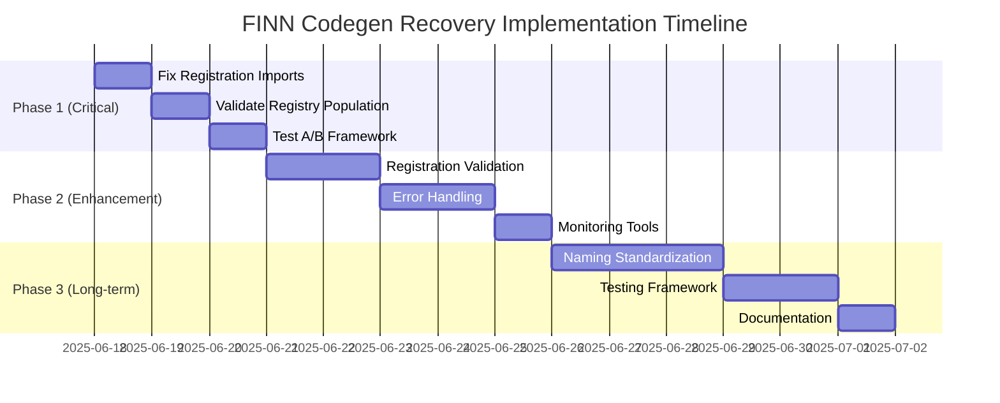

# FINN Codegen A/B Testing Framework - Recovery Implementation Plan

**Date:** June 18, 2025  
**Based on:** FINN_Codegen_Debugging_Report.md  
**Objective:** Restore and strengthen the FINN A/B testing framework  
**Priority:** Critical - System currently non-functional (0/3 test pass rate)

---

## Executive Summary

This implementation plan addresses the critical failure of the FINN codegen A/B testing framework by implementing a **phased recovery approach**:

1. **Phase 1 (Critical)**: Immediate fixes to restore basic functionality
2. **Phase 2 (Enhancement)**: Strengthen system reliability and monitoring
3. **Phase 3 (Long-term)**: Architectural improvements and standardization

**Estimated Timeline:** 2-3 weeks for full implementation  
**Immediate Recovery:** 2-3 days for Phase 1 critical fixes

---

## Implementation Phases



---

## Phase 1: Critical Recovery (Days 1-3)

### 🔥 Priority 1.1: Fix Registration Module Imports

**Objective:** Correct class name mismatches preventing global registry population

**Tasks:**

1. **Analyze Registration Modules**
   - Audit [`backend_registration.py`](src/finn/codegen/backend_registration.py:1)
   - Audit [`CG_backend_registration.py`](src/finn/codegen/CG_backend_registration.py:1)
   - Create mapping of intended vs actual class names

2. **Fix Import Statements**
   ```python
   # Current (BROKEN):
   from finn.custom_op.fpgadataflow.hls.thresholding_hls import ThresholdingHLS
   
   # Fixed (CORRECT):
   from finn.custom_op.fpgadataflow.hls.thresholding_hls import Thresholding_hls
   ```

3. **Systematic Correction Process**
   - Map all backend types to correct class names
   - Update import statements in both registration modules
   - Verify import paths match actual file locations

**Expected Fixes:**
- Thresholding: `ThresholdingHLS` → `Thresholding_hls`
- MVAU: `MVAU_HLS` → `MVAU_hls`  
- RTL backends: Similar naming corrections
- All backend types across HLS and RTL

**Success Criteria:**
- All registration module imports execute without errors
- No import exceptions in backend registration functions

### 🔥 Priority 1.2: Validate Registry Population

**Objective:** Verify global registries are properly populated after import fixes

**Tasks:**

1. **Enhanced Debug Script**
   - Extend [`debug_backends.py`](debug_backends.py:1) with detailed registry analysis
   - Add import error detection and reporting
   - Create registry population validation checks

2. **Registry Population Testing**
   ```python
   # Target registry population levels:
   # Legacy registry HLS backends: 20+ (currently 2)
   # Legacy registry RTL backends: 5+ (currently 0)
   # Clean registry HLS backends: 20+ (currently 1)
   # Clean registry RTL backends: 5+ (currently 0)
   ```

3. **Validation Automation**
   - Create script to verify minimum backend counts
   - Implement health check for registry completeness
   - Generate detailed registry status reports

**Success Criteria:**
- Legacy registry: 20+ HLS backends, 5+ RTL backends
- Clean registry: 20+ HLS backends, 5+ RTL backends
- All Thresholding backends available for A/B testing

### 🔥 Priority 1.3: Test A/B Framework Recovery

**Objective:** Verify A/B testing framework returns to functional state

**Tasks:**

1. **A/B Test Execution**
   - Run original failing test suite
   - Execute Thresholding HLS A/B tests specifically
   - Document test results and remaining failures

2. **Regression Testing**
   - Test multiple backend types (not just Thresholding)
   - Verify legacy vs clean comparisons work
   - Ensure no new failures introduced

**Success Criteria:**
- A/B testing framework shows >80% pass rate (target: 3/3 tests passing)
- "Functional equivalence failed" errors eliminated
- Both legacy and clean backends found for comparison

---

## Phase 2: System Enhancement (Days 4-8)

### 🛡️ Priority 2.1: Implement Registration Validation

**Objective:** Prevent future registration failures through proactive validation

**Implementation:**

1. **Startup Validation System**
   ```python
   # Create: src/finn/codegen/registration_validator.py
   class RegistrationValidator:
       def validate_global_registries(self):
           """Validate registry population at startup"""
           
       def check_backend_availability(self, backend_type):
           """Verify specific backend type is available"""
           
       def report_registration_health(self):
           """Generate comprehensive health report"""
   ```

2. **CI/CD Integration**
   - Add registration validation to test suite
   - Create automated registry health checks
   - Implement failure notifications for registration issues

3. **Runtime Monitoring**
   - Add registry population checks to initialization
   - Implement graceful degradation for missing backends
   - Create diagnostic tools for registration debugging

**Success Criteria:**
- Automatic detection of registration failures
- Early warning system for missing backends
- Comprehensive health monitoring dashboard

### 🛡️ Priority 2.2: Enhance Error Handling

**Objective:** Improve system resilience and error reporting

**Implementation:**

1. **Explicit Error Reporting**
   ```python
   # Enhanced registration with error handling
   try:
       from finn.custom_op.fpgadataflow.hls.thresholding_hls import Thresholding_hls
       register_backend('Thresholding', Thresholding_hls)
   except ImportError as e:
       logger.error(f"Failed to register Thresholding backend: {e}")
       # Continue with partial functionality
   ```

2. **Graceful Degradation**
   - Implement fallback mechanisms for missing backends
   - Provide clear error messages for unavailable operations
   - Maintain system functionality with reduced capability

3. **Debugging Tools Enhancement**
   - Expand [`debug_backends.py`](debug_backends.py:1) with error analysis
   - Create interactive diagnostic tools
   - Implement automatic problem resolution suggestions

**Success Criteria:**
- No silent failures in registration system
- Clear error messages for missing backends
- System continues operating with reduced functionality

### 🛡️ Priority 2.3: Monitoring and Alerting

**Objective:** Continuous monitoring of registration system health

**Implementation:**

1. **Health Monitoring Dashboard**
   - Real-time registry population tracking
   - Backend availability status display
   - Registration failure alert system

2. **Automated Testing Integration**
   - Continuous registration validation in CI/CD
   - Automated A/B testing framework health checks
   - Performance monitoring for registration operations

**Success Criteria:**
- 24/7 monitoring of registration system health
- Immediate alerts for registration failures
- Proactive detection of system degradation

---

## Phase 3: Long-term Improvements (Days 9-14)

### 📋 Priority 3.1: Standardize Naming Conventions

**Objective:** Establish consistent naming patterns to prevent future issues

**Implementation:**

1. **Naming Convention Documentation**
   ```markdown
   # FINN Backend Naming Standards
   
   ## Legacy Implementations
   - Pattern: `{Operation}_{backend_type}` (e.g., `Thresholding_hls`)
   - Class naming: PascalCase with underscores
   
   ## Clean Implementations  
   - Pattern: `CG_{Operation}{BackendType}` (e.g., `CG_ThresholdingHLS`)
   - Class naming: PascalCase without underscores
   
   ## File naming
   - Legacy: `{operation}_{backend_type}.py`
   - Clean: `CG_{operation}_{backend_type}.py`
   ```

2. **Automated Naming Validation**
   - Create linting rules for backend naming
   - Implement naming convention checks in CI/CD
   - Add naming validation to registration system

3. **Migration Guide**
   - Document naming convention changes
   - Create automated migration tools
   - Provide developer guidelines for new backends

**Success Criteria:**
- Consistent naming across all backend implementations
- Automated validation of naming conventions
- Clear documentation for developers

### 📋 Priority 3.2: Strengthen Testing Framework

**Objective:** Comprehensive testing of registration and A/B testing systems

**Implementation:**

1. **Registration System Unit Tests**
   ```python
   # Create: tests/test_backend_registration.py
   class TestBackendRegistration:
       def test_module_level_registration(self):
           """Test module-level backend registration"""
           
       def test_global_registry_population(self):
           """Test global registry population"""
           
       def test_backend_availability(self):
           """Test backend availability queries"""
   ```

2. **A/B Testing Framework Tests**
   - Automated A/B testing validation
   - Backend comparison functionality tests
   - Performance and reliability testing

3. **Integration Testing**
   - End-to-end registration system testing
   - Cross-backend compatibility testing
   - System resilience testing

**Success Criteria:**
- Comprehensive test coverage for registration system
- Automated validation of A/B testing framework
- Continuous integration testing

### 📋 Priority 3.3: Documentation and Knowledge Transfer

**Objective:** Comprehensive documentation for system maintenance

**Implementation:**

1. **Technical Documentation**
   - Registration system architecture documentation
   - A/B testing framework user guide
   - Troubleshooting and debugging guide

2. **Developer Resources**
   - Backend development guidelines
   - Registration system API documentation
   - Best practices for system maintenance

3. **Training Materials**
   - System overview presentations
   - Hands-on debugging workshops
   - Maintenance procedures documentation

**Success Criteria:**
- Complete system documentation
- Developer onboarding materials
- Knowledge transfer completion

---

## Risk Assessment and Mitigation

### High Risk Items

1. **Import Path Changes**
   - **Risk**: Fixing imports may break other system components
   - **Mitigation**: Comprehensive testing before deployment
   - **Contingency**: Maintain backup of working module-level registrations

2. **Backend Compatibility**
   - **Risk**: Legacy and clean backends may have functional differences
   - **Mitigation**: Thorough A/B testing validation
   - **Contingency**: Selective backend availability based on compatibility

3. **System Complexity**
   - **Risk**: Multi-tier architecture makes debugging difficult
   - **Mitigation**: Enhanced debugging tools and monitoring
   - **Contingency**: Simplified registration system fallback

### Medium Risk Items

1. **Performance Impact**
   - **Risk**: Enhanced validation may slow system startup
   - **Mitigation**: Optimize validation algorithms
   - **Contingency**: Configurable validation levels

2. **Maintenance Burden**
   - **Risk**: Complex monitoring systems require ongoing maintenance
   - **Mitigation**: Automated maintenance tools
   - **Contingency**: Simplified monitoring with core functionality

---

## Success Metrics

### Phase 1 Success Criteria
- [ ] A/B testing framework achieves 100% pass rate (3/3 tests)
- [ ] Global registries populated with expected backend counts
- [ ] No "Functional equivalence failed" errors

### Phase 2 Success Criteria
- [ ] Registration validation system operational
- [ ] Error handling prevents silent failures
- [ ] Monitoring system provides real-time health status

### Phase 3 Success Criteria
- [ ] Naming conventions standardized and documented
- [ ] Comprehensive test suite achieves >95% coverage
- [ ] Complete documentation and training materials

---

## Implementation Dependencies

### Technical Dependencies
- Access to FINN codebase and git history
- Docker development environment
- Testing infrastructure

### Resource Dependencies
- Development time: 2-3 weeks
- Testing environment availability
- Documentation and training time

### Stakeholder Dependencies
- System architecture review and approval
- Testing validation and sign-off
- Documentation review and acceptance

---

## Conclusion

This implementation plan provides a structured approach to recovering and strengthening the FINN A/B testing framework. The phased approach ensures:

1. **Immediate Recovery**: Critical fixes restore basic functionality
2. **System Reliability**: Enhanced monitoring prevents future failures
3. **Long-term Stability**: Standardization and documentation ensure maintainability

**Key Success Factors:**
- Systematic approach to import corrections
- Comprehensive validation and monitoring
- Thorough testing and documentation

The plan addresses both immediate needs and long-term system health, providing a robust foundation for the FINN codegen A/B testing framework.

---

*This implementation plan serves as a roadmap for restoring and enhancing the FINN codegen A/B testing framework based on the findings from the debugging report.*