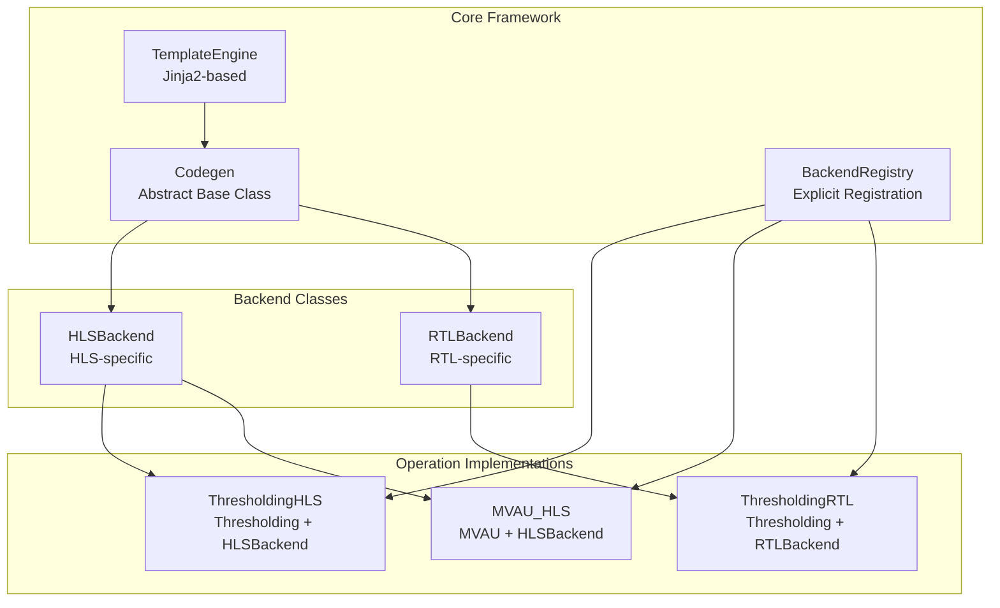

# FINN Universal Codegen Refactor: Current State Analysis

## Executive Summary

The FINN universal codegen refactor represents a significant architectural improvement, replacing brittle string-based code generation with a robust Jinja2-based template system. However, the implementation shows clear signs of iterative development with incomplete migration, compatibility bloat, and mixed paradigms that need consolidation.

## Architecture Overview

### Core Components



### Key Files Modified

| Component | File | Status |
|-----------|------|--------|
| Core Framework | [`src/finn/codegen/codegen.py`](src/finn/codegen/codegen.py:1) | ✅ Well-implemented |
| Template Engine | [`src/finn/codegen/template_engine.py`](src/finn/codegen/template_engine.py:1) | ✅ Clean, focused |
| HLS Backend | [`src/finn/custom_op/fpgadataflow/hlsbackend.py`](src/finn/custom_op/fpgadataflow/hlsbackend.py:1) | ⚠️ Compatibility bloat |
| RTL Backend | [`src/finn/custom_op/fpgadataflow/rtlbackend.py`](src/finn/custom_op/fpgadataflow/rtlbackend.py:1) | ⚠️ Similar issues |
| Registration | [`src/finn/codegen/backend_registration.py`](src/finn/codegen/backend_registration.py:1) | ✅ Explicit, clean |
| Configuration | [`src/finn/codegen/config.py`](src/finn/codegen/config.py:1) | ✅ Simple, effective |

## Implementation Analysis

### What Works Well

#### 1. Core Architecture Design

The abstract [`Codegen`](src/finn/codegen/codegen.py:50) base class provides a clean, consistent interface:

```python
@abstractmethod
def get_template_name(self) -> str:
    """Get explicit template name for this backend."""
    pass

@abstractmethod
def get_template_values(self, template_name: str) -> Dict[str, Any]:
    """Extract values for specified template."""
    pass
```

This enforces explicit template declaration and structured value extraction across all implementations.

#### 2. Template Engine Implementation

The [`TemplateEngine`](src/finn/codegen/template_engine.py:16) is well-designed:

- **Strategic Caching**: Only caches expensive template compilation, not values
- **Custom Filters**: FINN-specific Jinja2 filters for code generation
- **Clean API**: Simple `render()` method with good error handling
- **Performance-Focused**: LRU cache with sensible 50-template limit

#### 3. Explicit Backend Registration

The registration system in [`backend_registration.py`](src/finn/codegen/backend_registration.py:12) eliminates fragile auto-discovery:

```python
def register_all_backends() -> BackendRegistry:
    try:
        from ..custom_op.fpgadataflow.hls.thresholding_hls import ThresholdingHLS
        registry.register_hls_backend('Thresholding', ThresholdingHLS)
    except ImportError as e:
        logger.debug(f"Could not import ThresholdingHLS: {e}")
```

This provides predictable, maintainable backend loading.

### Current Problems

#### 1. Compatibility Bloat in Backend Classes

Both [`HLSBackend`](src/finn/custom_op/fpgadataflow/hlsbackend.py:50) and [`RTLBackend`](src/finn/custom_op/fpgadataflow/rtlbackend.py:45) maintain extensive legacy compatibility:

```python
# NEW: Use template engine for CPP generation
self.set_template_override("hls/ipgen.cpp.j2")
cpp_code = self.generate_code()

# LEGACY: Still populate code_gen_dict for backward compatibility
self.code_gen_dict["$AP_INT_MAX_W$"] = [str(self.get_ap_int_max_w())]
self.generate_params(model, path)
```

This dual approach creates confusion and maintenance burden.

#### 2. Mixed Implementation Paradigms

Operations show inconsistent migration levels:

**Clean Implementation** ([`ThresholdingHLS`](src/finn/custom_op/fpgadataflow/hls/thresholding_hls.py:36)):
```python
def _generate_defines(self, mode: str) -> str:
    """Generate defines directly."""
    defines = [
        f"#define NumChannels1 {self.get_nodeattr('NumChannels')}",
        f"#define PE1 {self.get_nodeattr('PE')}"
    ]
    return '\n'.join(defines)
```

**Bloated Implementation** ([`MVAU_HLS`](src/finn/custom_op/fpgadataflow/hls/mvau_hls.py:24)):
```python
def get_supported_templates(self) -> Set[str]:
    templates = {
        'hls_mvau_basic.cpp.j2', 'hls_mvau_simple.cpp.j2',
        'hls_mvau_streaming.cpp.j2', 'hls_mvau_streaming_optimized.cpp.j2',
        # ... 12 more templates
    }
```

#### 3. Template Value Extraction Inconsistency

Some operations convert legacy `code_gen_dict` while others generate values directly:

```python
# Legacy conversion approach (HLSBackend)
def _get_globals_from_code_gen_dict(self) -> str:
    if '$GLOBALS$' in self.code_gen_dict:
        return '\n'.join(self.code_gen_dict['$GLOBALS$'])
    return '// No globals'

# Direct generation approach (ThresholdingHLS)  
def _generate_globals(self) -> str:
    includes = ['#include "activations.hpp"', '#include "params.h"']
    return '\n'.join(includes)
```

#### 4. Multiple Inheritance Complexity

Operations use multiple inheritance which can create attribute conflicts:

```python
class ThresholdingHLS(Thresholding, HLSBackend):
    def get_nodeattr_types(self) -> Dict[str, Any]:
        # Complex merge logic needed to handle conflicts
        operation_attrs = {}
        for base in self.__class__.__bases__:
            if hasattr(base, 'get_nodeattr_types') and base != HLSBackend:
                operation_attrs = base.get_nodeattr_types(self)
```

## Template System Analysis

### Template Organization

```
src/finn/codegen/templates/
├── hls/
│   ├── docompute.cpp.j2
│   ├── docompute_timeout.cpp.j2
│   ├── ipgen.cpp.j2
│   └── ipgen.tcl.j2
├── rtl/
│   ├── thresholding_wrapper.v.j2
│   └── mvau_wrapper.v.j2
└── thresholding/
    ├── hls/
    │   ├── docompute.cpp.j2
    │   └── ipgen.cpp.j2
    └── rtl/
        └── wrapper.v.j2
```

### Template Quality Assessment

**Good Template Example** ([`docompute.cpp.j2`](src/finn/codegen/templates/thresholding/hls/docompute.cpp.j2:1)):
```jinja2
#define AP_INT_MAX_W {{ AP_INT_MAX_W }}
// includes for network parameters
{{ GLOBALS }}
// defines for network parameters  
{{ DEFINES }}
{{ DOCOMPUTE }}
```

Clean, focused placeholders that map directly to implementation methods.

## Migration Status by Component

### ✅ Fully Migrated
- **Core Framework**: Complete and working
- **Template Engine**: Clean implementation
- **Backend Registry**: Explicit registration working
- **Configuration System**: Simple, effective

### ⚠️ Partially Migrated  
- **HLSBackend**: New system works but legacy compatibility bloat
- **RTLBackend**: Similar compatibility issues
- **ThresholdingHLS**: Clean implementation but uses hybrid approach

### ❌ Legacy Artifacts Remaining
- **code_gen_dict usage**: Still present throughout backends
- **Legacy methods**: `global_includes()`, `defines()`, etc. still called
- **String replacement**: Some operations still use old paradigm

## Critical Issues Requiring Resolution

### 1. Inconsistent Template Value Generation

**Problem**: Mix of direct generation and legacy conversion creates maintenance burden.

**Evidence**:
```python
# HLSBackend - legacy conversion
template_values.update({
    'GLOBALS': self._get_globals_from_code_gen_dict(),
    'DEFINES': self._get_defines_from_code_gen_dict(),
})

# ThresholdingHLS - direct generation  
template_values.update({
    'GLOBALS': self._generate_globals(),
    'DEFINES': self._generate_defines("cppsim"),
})
```

### 2. Template Selection Complexity

**Problem**: Operations vary from simple explicit templates to complex selection logic.

**Simple** (ThresholdingHLS):
```python
template_name = "thresholding/hls/docompute.cpp.j2"
```

**Complex** (MVAU_HLS):
```python
def _get_template_priority_order(self) -> List[str]:
    return ['hls_mvau_streaming_optimized.cpp.j2', ...]
```

### 3. Backwards Compatibility Overhead

**Problem**: Extensive legacy method preservation complicates codebase.

**Evidence**: HLSBackend maintains both new template system and all legacy methods like [`code_generation_cppsim()`](src/finn/custom_op/fpgadataflow/hlsbackend.py:496).

## Recommendations for Consolidation

### 1. Standardize Template Value Generation

**Remove** all `code_gen_dict` conversion methods and `_get_*_from_code_gen_dict()`.

**Implement** direct generation methods consistently:
```python
def get_template_values(self, template_name: str) -> Dict[str, Any]:
    return {
        'GLOBALS': self._generate_globals(),
        'DEFINES': self._generate_defines(),  
        'DOCOMPUTE': self._generate_docompute(),
    }
```

### 2. Simplify Template Selection

**Standardize** on explicit template declaration:
```python
class ThresholdingHLS(Thresholding, HLSBackend):
    TEMPLATE_NAME = "thresholding/hls/docompute.cpp.j2"
```

**Remove** complex template selection logic unless truly necessary.

### 3. Remove Legacy Compatibility 

**Deprecate** and remove:
- `code_gen_dict` usage entirely
- Legacy methods: `global_includes()`, `defines()`, `docompute()`, etc.
- String replacement template rendering

**Keep** only the new Jinja2-based system.

### 4. Consolidate Backend Implementations

**Extract** common template value generation to base classes:
```python
class HLSBackend(Codegen):
    def _generate_common_hls_values(self) -> Dict[str, Any]:
        """Generate values common to all HLS operations."""
        return {
            'AP_INT_MAX_W': self.get_ap_int_max_w(),
            'PRAGMAS': self._generate_hls_pragmas(),
        }
```

## Conclusion

The FINN universal codegen refactor has established a solid architectural foundation with significant improvements over the previous brittle system. The core framework is well-designed and the template engine is effective.

However, the implementation suffers from **incomplete migration** and **compatibility bloat** that obscures the clean architecture underneath. The system would benefit greatly from:

1. **Aggressive cleanup** of legacy compatibility code
2. **Standardization** of template value generation approaches  
3. **Simplification** of template selection mechanisms
4. **Consolidation** of common functionality in base classes

With focused cleanup effort, this could become an exemplary, maintainable code generation system that fully realizes the benefits of the architectural improvements.

---

**Analysis Date**: 2025-01-18  
**Commit Analyzed**: `20d2abc99249fc736392a046fd798e9ce5789b9a` to current  
**Files Examined**: 83 total, focusing on core implementation files