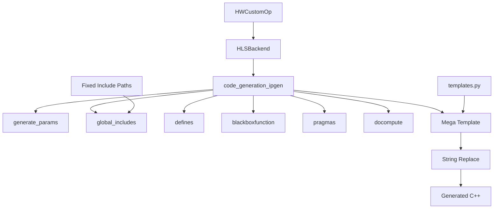

# FINN C++ Code Generation Analysis & Refactor Plan

## Executive Summary

The current FINN HLS C++ code generation system in [`hlsbackend.py`](src/finn/custom_op/fpgadataflow/hlsbackend.py) suffers from inflexibility due to its mega-template approach and rigid assumptions about include file locations. This analysis examines the current architecture and proposes a comprehensive refactor to enable flexible custom operation development and dynamic library sourcing.

## Current Architecture Problems

### 1. **Mega-Template Monolith**
- Single large templates in [`templates.py`](src/finn/custom_op/fpgadataflow/templates.py) that all operations must conform to
- Rigid placeholder system (`$GLOBALS$`, `$DEFINES$`, `$DOCOMPUTE$`, etc.)
- No way for operations to define custom template structures

### 2. **Hard-Coded Include Management**  
- Fixed assumptions about hpp file locations (e.g., `#include "weights.hpp"`, `#include "mvau.hpp"`)
- No flexible dependency resolution system
- Cannot easily source from different libraries based on operation requirements

### 3. **Inflexible Code Generation Pipeline**
The [`code_generation_ipgen()`](src/finn/custom_op/fpgadataflow/hlsbackend.py:109) method follows a rigid sequence:

```python
self.generate_params(model, path)
self.global_includes()
self.defines("ipgen") 
self.blackboxfunction()
self.pragmas()
self.docompute()
# Then force-fit into mega-template
```

### 4. **String-Replace Code Assembly**
All code generation relies on basic string replacement in mega-templates, making it difficult to:
- Generate different C++ code structures
- Handle conditional compilation patterns
- Support varying file organizations

## Current System Architecture Analysis

### HLS Backend Flow


### RTL Backend Comparison
The RTL backend ([`rtlbackend.py`](src/finn/custom_op/fpgadataflow/rtlbackend.py)) is notably simpler and more flexible:
- Operations implement [`generate_hdl()`](src/finn/custom_op/fpgadataflow/rtl/matrixvectoractivation_rtl.py:259) directly
- No mega-templates - each operation controls its own code generation
- Flexible file sourcing with [`get_rtl_file_list()`](src/finn/custom_op/fpgadataflow/rtl/matrixvectoractivation_rtl.py:336)

## Pain Points Identified

Based on user requirements:
1. **Difficulty adding new custom operations** that don't fit existing template structure
2. **Rigid assumptions about hpp file locations** preventing flexible library sourcing
3. **Inflexible code generation patterns** limiting operation-specific requirements

## Proposed Refactor Plan

### Phase 1: Modular Code Generation Framework

#### 1.1 Create Pluggable Code Generators
```python
# New: CodeGenerator base class
class CodeGenerator(ABC):
    @abstractmethod
    def generate_includes(self) -> List[str]
    
    @abstractmethod 
    def generate_defines(self) -> List[str]
    
    @abstractmethod
    def generate_main_function(self) -> str
    
    @abstractmethod
    def get_template_name(self) -> str
    
    def get_custom_templates(self) -> Dict[str, str]:
        """Override to provide operation-specific templates"""
        return {}
```

#### 1.2 Flexible Include Resolution System
```python 
# New: IncludeManager class
class IncludeManager:
    def __init__(self):
        self.include_paths = []
        self.library_mappings = {}
    
    def register_library(self, name: str, base_path: str, headers: List[str])
    def resolve_includes(self, operation_type: str) -> List[str]
    def add_custom_include(self, path: str, condition: Optional[Callable] = None)
```

#### 1.3 Template Engine Replacement
Replace string replacement with a proper template engine (Jinja2) that supports:
- Conditional blocks
- Loops and iteration
- Template inheritance
- Custom filters and functions

### Phase 2: Operation-Specific Code Generation

#### 2.1 Per-Operation Code Generators
Each operation can define its own code generation strategy:
```python
class MVAUCodeGenerator(CodeGenerator):
    def get_template_name(self) -> str:
        mem_mode = self.operation.get_nodeattr("mem_mode")
        if mem_mode == "internal_embedded":
            return "mvau_embedded.cpp.j2"
        else:
            return "mvau_streaming.cpp.j2"
    
    def generate_includes(self) -> List[str]:
        includes = ["mvau.hpp"]
        if self.operation.calc_tmem() != 0:
            includes.append("thresh.h")
        return includes
```

#### 2.2 Flexible File Organization
```python
# New: FileOrganizer class  
class FileOrganizer:
    def __init__(self, base_dir: str):
        self.base_dir = base_dir
        self.file_patterns = {}
    
    def register_pattern(self, file_type: str, pattern: str)
    def generate_filename(self, file_type: str, context: Dict) -> str
    def ensure_directory_structure(self)
```

### Phase 3: Dependency & Library Management

#### 3.1 Library Registry System
```python
# New: LibraryRegistry 
class LibraryRegistry:
    def __init__(self):
        self.libraries = {}
    
    def register_library(self, lib: LibrarySpec)
    def get_dependencies(self, operations: List[HWCustomOp]) -> Set[LibrarySpec]
    def resolve_include_paths(self, dependencies: Set[LibrarySpec]) -> List[str]

@dataclass
class LibrarySpec:
    name: str
    base_path: str  
    headers: List[str]
    conditions: List[Callable]  # When to include this library
    priority: int = 0
```

#### 3.2 Dynamic Include Resolution
Operations specify their library requirements declaratively:
```python
class MVAU_hls(MVAU, HLSBackend):
    def get_library_requirements(self) -> List[str]:
        libs = ["finn-hlslib", "bnn-library"]
        if self.get_nodeattr("mem_mode") == "internal_decoupled":
            libs.append("memstream")
        return libs
    
    def get_custom_includes(self) -> List[str]:
        # Operation-specific headers beyond standard libraries
        return ["custom_mvau_helpers.hpp"] if self.has_custom_config() else []
```

### Phase 4: Template Modernization

#### 4.1 Template Hierarchy
Replace mega-templates with composable template hierarchy:
```
templates/
├── base/
│   ├── cppsim_base.cpp.j2
│   └── ipgen_base.cpp.j2  
├── operations/
│   ├── mvau/
│   │   ├── mvau_embedded.cpp.j2
│   │   └── mvau_streaming.cpp.j2
│   └── thresholding/
│       └── thresholding.cpp.j2
└── components/
    ├── includes.j2
    ├── pragmas.j2  
    └── stream_declarations.j2
```

#### 4.2 Template Context Builder
```python
class TemplateContextBuilder:
    def build_context(self, operation: HWCustomOp, mode: str) -> Dict:
        context = {
            'operation': operation,
            'mode': mode,
            'includes': self.resolve_includes(operation),
            'defines': self.generate_defines(operation, mode),
            # ... other context
        }
        return context
```

### Phase 5: Backward Compatibility & Migration

#### 5.1 Legacy Adapter
Provide adapter layer so existing operations continue working:
```python
class LegacyTemplateAdapter(CodeGenerator):
    """Adapter for operations still using old template system"""
    def generate_code(self) -> str:
        # Delegate to old string-replacement system
        return self.operation.legacy_code_generation()
```

#### 5.2 Gradual Migration Path  
- Keep existing [`templates.py`](src/finn/custom_op/fpgadataflow/templates.py) during transition
- Operations opt-in to new system via attribute: `use_modern_codegen = True`
- Provide migration utilities to convert existing operations

## Benefits of This Refactor

1. **Flexible Operation Support**: Easy to add operations with unique code generation needs
2. **Dynamic Library Management**: Automatic dependency resolution based on included operations  
3. **Maintainable Templates**: Modular, composable templates instead of mega-templates
4. **Extensible Architecture**: Plugin system for custom code generators
5. **Better Separation of Concerns**: Clean separation between code generation logic and templates
6. **Backward Compatibility**: Existing operations continue working during migration

## Next Steps

1. **Analyze RTL Backend in Detail**: Examine how RTL code generation works to determine if systems should be unified
2. **Create Detailed Implementation Plan**: Break down the refactor into specific development tasks
3. **Prototype Core Framework**: Build the foundational classes (CodeGenerator, IncludeManager, etc.)
4. **Migrate One Operation**: Choose a representative operation for the first migration
5. **Iterative Rollout**: Gradually migrate other operations and gather feedback

## Open Questions

1. Should the RTL backend also be modernized or is its current architecture sufficient?
2. What template engine should be used (Jinja2, Mako, custom)?
3. How should the library registry be populated - configuration files, code registration, or discovery?
4. What migration timeline is acceptable for existing operations?

---

*Analysis Date: 2025-01-16*  
*Scope: FINN HLS C++ Code Generation System*  
*Status: Initial Analysis Complete, Awaiting RTL Analysis*