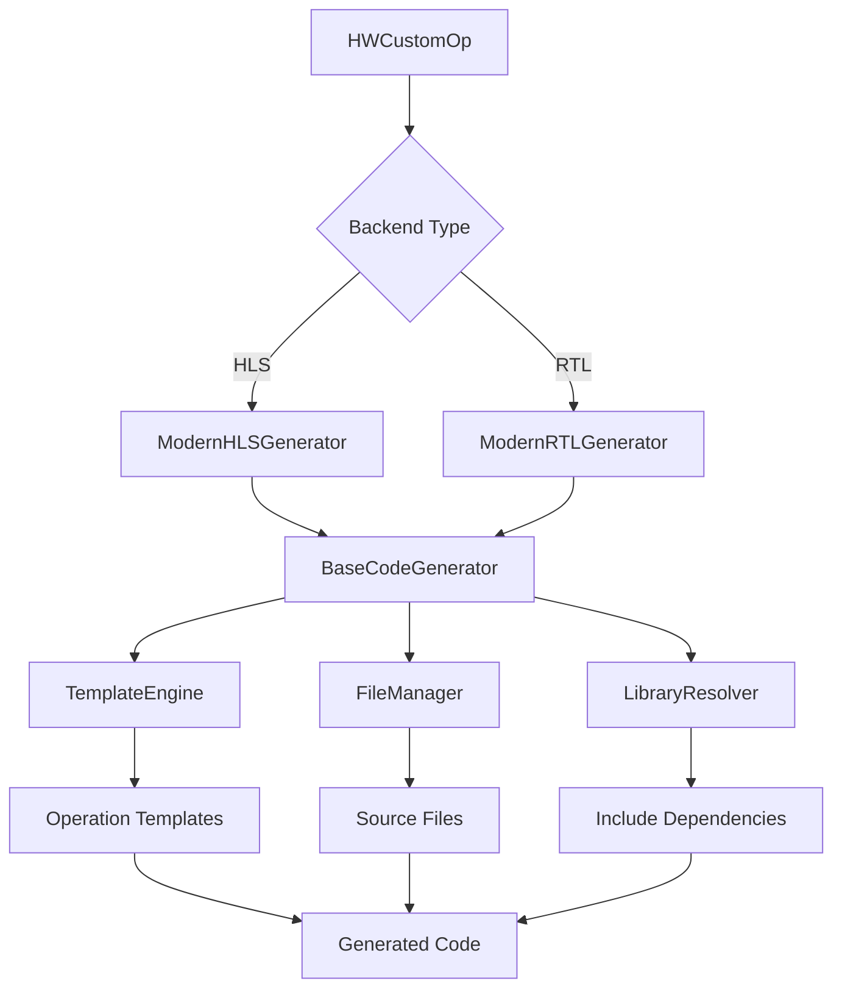

# FINN Unified Code Generation Architecture Analysis

## RTL Backend Analysis - Key Findings

After examining [`streamingfifo_rtl.py`](src/finn/custom_op/fpgadataflow/rtl/streamingfifo_rtl.py), [`thresholding_rtl.py`](src/finn/custom_op/fpgadataflow/rtl/thresholding_rtl.py), and [`matrixvectoractivation_rtl.py`](src/finn/custom_op/fpgadataflow/rtl/matrixvectoractivation_rtl.py), the RTL backend demonstrates significantly better design principles than the HLS system.

### RTL Backend Strengths

#### 1. **Operation-Driven Architecture**
Each RTL operation implements [`generate_hdl()`](src/finn/custom_op/fpgadataflow/rtl/thresholding_rtl.py:301) directly:
```python
def generate_hdl(self, model, fpgapart, clk):
    # Operation controls its own generation process
    code_gen_dict = self.prepare_codegen_rtl_values(model)
    # Apply to operation-specific template
    # Handle file management
```

#### 2. **Targeted Templates** 
- **FIFO**: [`fifo_template.v`](src/finn/custom_op/fpgadataflow/rtl/streamingfifo_rtl.py:87) - Simple, focused template
- **Thresholding**: [`thresholding_template_wrapper.v`](src/finn/custom_op/fpgadataflow/rtl/thresholding_rtl.py:314) - Operation-specific
- **MVAU**: [`mvu_vvu_axi_wrapper.v`](src/finn/custom_op/fpgadataflow/rtl/matrixvectoractivation_rtl.py:308) - Targeted for matrix operations

No mega-templates forcing all operations into the same structure.

#### 3. **Clean File Management**
```python
def get_rtl_file_list(self, abspath=False):
    # Returns exactly what files this operation needs
    # Can source from multiple locations: finn-rtllib, code_gen_dir, etc.
    verilog_files = [
        rtllib_dir + "core_files.sv",
        code_gen_dir + "generated_wrapper.v"
    ]
    return verilog_files
```

#### 4. **Simple but Effective Template Processing**
```python
def generate_hdl(self, model, fpgapart, clk):
    code_gen_dict = {}
    code_gen_dict["$MODULE_NAME$"] = topname
    code_gen_dict["$WIDTH$"] = str(in_width)
    
    with open(template_path, "r") as f:
        template = f.read()
    for key in code_gen_dict:
        template = template.replace(key, str(code_gen_dict[key]))
```

### RTL vs HLS Architecture Comparison

| Aspect | RTL Backend | HLS Backend |
|--------|-------------|-------------|
| **Architecture** | Operation-driven ✅ | Template-driven ❌ |
| **Templates** | Operation-specific ✅ | Mega-templates ❌ |
| **File Management** | Flexible sourcing ✅ | Fixed assumptions ❌ |
| **Code Generation** | Direct control ✅ | Rigid pipeline ❌ |
| **Extensibility** | High ✅ | Low ❌ |
| **Maintainability** | Isolated changes ✅ | Brittle global templates ❌ |

### RTL Weaknesses (Minor)
1. **Code Duplication**: Template processing logic repeated across operations
2. **Basic Template Engine**: Only string replacement (no conditionals, loops)
3. **No Shared Utilities**: Each operation handles file management independently

## Recommended Unified Architecture

### Core Principle: **Adopt RTL's Operation-Driven Pattern**

The RTL backend already demonstrates the correct architectural approach. Instead of forcing RTL into HLS's broken pattern, we should evolve **both** systems toward RTL's successful model.

### Unified Framework Design



#### 1. **BaseCodeGenerator** - Shared Infrastructure
```python
class BaseCodeGenerator(ABC):
    def __init__(self, operation: HWCustomOp):
        self.operation = operation
        self.template_engine = TemplateEngine()
        self.file_manager = FileManager()
        self.library_resolver = LibraryResolver()
    
    @abstractmethod
    def get_template_name(self) -> str:
        pass
    
    @abstractmethod 
    def prepare_context(self, model, fpgapart, clk) -> Dict:
        pass
    
    def generate_code(self, model, fpgapart, clk) -> str:
        # Shared generation logic
        context = self.prepare_context(model, fpgapart, clk)
        template = self.get_template_name()
        return self.template_engine.render(template, context)
```

#### 2. **Modern HLS Generator** - Replaces Mega-Templates
```python
class ModernHLSGenerator(BaseCodeGenerator):
    def get_template_name(self) -> str:
        # Operation-specific template selection
        if self.operation.get_nodeattr("mem_mode") == "internal_embedded":
            return "hls/mvau_embedded.cpp.j2"
        else:
            return "hls/mvau_streaming.cpp.j2"
    
    def prepare_context(self, model, fpgapart, clk) -> Dict:
        return {
            'includes': self.resolve_includes(),
            'defines': self.generate_defines(),
            'operation': self.operation,
            # ... context specific to this operation
        }
```

#### 3. **Enhanced RTL Generator** - Builds on RTL Success
```python
class ModernRTLGenerator(BaseCodeGenerator):
    def get_template_name(self) -> str:
        return f"rtl/{self.operation.onnx_node.op_type.lower()}_wrapper.v.j2"
    
    def prepare_context(self, model, fpgapart, clk) -> Dict:
        # Enhanced version of current RTL prepare_codegen_rtl_values
        return self.prepare_codegen_rtl_values(model)
```

#### 4. **Modern Template Engine** - Replaces String Replacement
```python
class TemplateEngine:
    def __init__(self):
        self.jinja_env = jinja2.Environment(
            loader=jinja2.FileSystemLoader(['templates/hls', 'templates/rtl'])
        )
    
    def render(self, template_name: str, context: Dict) -> str:
        template = self.jinja_env.get_template(template_name)
        return template.render(**context)
```

#### 5. **Smart Library Resolver** - Solves Include Problem
```python
class LibraryResolver:
    def __init__(self):
        self.libraries = {
            'finn-hlslib': LibrarySpec('$FINN_DEPS_DIR/finn-hlslib', ['mvau.hpp', 'utils.hpp']),
            'bnn-library': LibrarySpec('$FINN_ROOT/custom_hls', ['bnn-library.h']),
            'finn-rtllib': LibrarySpec('$FINN_ROOT/finn-rtllib', ['*.sv', '*.v'])
        }
    
    def resolve_includes(self, operation: HWCustomOp) -> List[str]:
        # Dynamic resolution based on operation requirements
        pass
```

### Implementation Strategy

#### Phase 1: Modernize RTL (Low Risk)
- Add Jinja2 template engine support to existing RTL operations
- Extract common template processing into BaseCodeGenerator
- Keep existing functionality 100% working

#### Phase 2: Create HLS Operation Generators (Medium Risk)
- Build ModernHLSGenerator for one operation (e.g., MVAU)
- Create operation-specific templates to replace mega-template sections
- Prove the concept works with existing operation

#### Phase 3: Unified Framework (High Impact)
- Complete BaseCodeGenerator infrastructure
- Migrate remaining operations
- Deprecate mega-templates

### Benefits of Unified Approach

#### For HLS Operations:
1. **Flexible Templates**: Each operation can define its own structure
2. **Dynamic Includes**: Automatic library dependency resolution  
3. **Better Maintainability**: Changes isolated to specific operations
4. **Modern Template Features**: Conditionals, loops, inheritance

#### For RTL Operations:
1. **Reduced Code Duplication**: Shared template processing infrastructure
2. **Enhanced Template Engine**: Jinja2 features while keeping simplicity
3. **Standardized Patterns**: Consistent file management across operations

#### For Both Systems:
1. **Consistent Architecture**: Same patterns for HLS and RTL
2. **Shared Infrastructure**: Template engine, file management, library resolution
3. **Better Extensibility**: Easy to add new operations with custom requirements
4. **Maintainable Codebase**: Clear separation of concerns

## Decision: Unified Evolution

**Recommendation**: Create a unified framework that adopts RTL's successful operation-driven architecture while providing modern infrastructure for both backends.

**Key Insight**: RTL already demonstrates the right design principles. Instead of over-engineering or forcing RTL into HLS's broken pattern, we should evolve both systems toward RTL's proven model while adding modern conveniences.

This approach:
- ✅ Fixes HLS mega-template inflexibility
- ✅ Maintains RTL's successful simplicity  
- ✅ Provides shared infrastructure benefits
- ✅ Enables easy custom operation development
- ✅ Solves dynamic library sourcing requirements

---

*Analysis Date: 2025-01-16*  
*Conclusion: Unified framework based on RTL's operation-driven success*