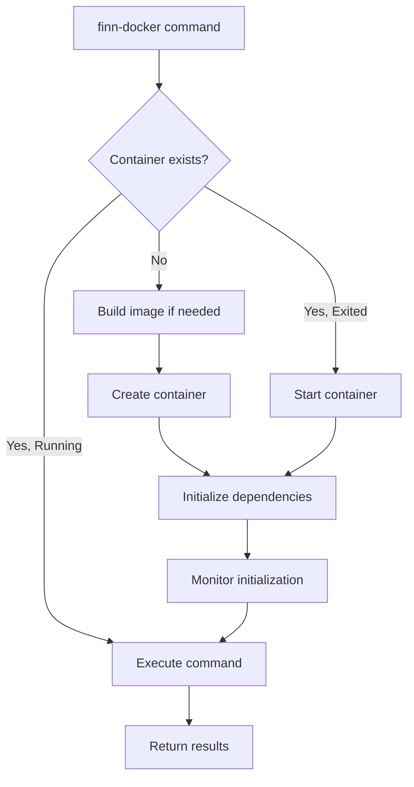

# FINN Docker Orchestration Modernization Design

## Executive Summary

This document proposes modernizing FINN's Docker orchestration system by adopting the robust architecture pioneered by Brainsmith. The new system, centered around a `finn-docker` command-line tool, will provide persistent containers, improved performance, better error handling, and enhanced developer experience while maintaining backward compatibility.

## Goals and Objectives

### Primary Goals
1. **Persistent Containers**: Enable container reuse to eliminate redundant initialization overhead
2. **Performance**: Achieve 70%+ speedup for common operations through caching and optimization
3. **Developer Experience**: Provide intuitive commands and clear status feedback
4. **CI/CD Integration**: Support automated workflows with structured status reporting
5. **Backward Compatibility**: Maintain support for existing `run-docker.sh` workflows

### Secondary Goals
1. **Resource Efficiency**: Minimize disk and memory usage through smart caching
2. **Error Recovery**: Provide robust error handling with clear recovery paths
3. **Extensibility**: Design for future enhancements without breaking changes
4. **Security**: Maintain security best practices for container operations

## Architecture Overview

### Component Structure
```
finn/
├── finn-docker                    # Main orchestration script (replaces run-docker.sh)
├── run-docker.sh                  # Legacy script (wrapper to finn-docker)
├── docker/
│   ├── Dockerfile.finn            # Updated Dockerfile
│   ├── entrypoint.sh              # Primary entrypoint with initialization
│   ├── entrypoint_exec.sh         # Fast execution entrypoint
│   └── entrypoint_common.sh       # Shared environment setup
├── fetch-repos.sh                 # Dependency fetching (enhanced)
└── config/
    ├── finn_repos.yaml            # Repository dependencies (new)
    └── docker_defaults.env        # Default environment settings (new)
```

### Container Lifecycle Management

#### Container States
1. **Not Found**: Container doesn't exist
2. **Running**: Container is active and ready
3. **Exited**: Container exists but stopped
4. **Initializing**: Container starting up with dependency installation

#### Persistent Container Flow


## Detailed Design

### 1. Command-Line Interface

#### Basic Commands
```bash
# Start persistent daemon container
finn-docker init

# Execute command in container
finn-docker exec "pytest tests/"

# Interactive shell
finn-docker shell

# Stop container
finn-docker stop

# Remove container
finn-docker clean

# Show status
finn-docker status

# View logs
finn-docker logs
```

#### Advanced Usage
```bash
# Run make target
finn-docker make test

# Run specific test
finn-docker pytest tests/test_specific.py

# Build dataflow (backward compatible)
finn-docker build_dataflow /path/to/build

# Custom command with arguments
finn-docker exec "python script.py --arg1 value1"
```

### 2. Container Initialization System

#### Status Reporting Protocol
```bash
# Status format: FINN_STATUS:<TYPE>[:DETAIL]
echo "FINN_STATUS:INITIALIZING"
echo "FINN_STATUS:FETCHING_DEPENDENCIES"
echo "FINN_STATUS:INSTALLING_PACKAGES:qonnx"
echo "FINN_STATUS:BUILDING_EXTENSIONS"
echo "FINN_STATUS:READY"
echo "FINN_STATUS:ERROR:Failed to install package X"
```

#### Initialization Phases
1. **Environment Setup** (5-10s)
   - Configure paths and environment variables
   - Set up user permissions
   - Create necessary directories

2. **Dependency Fetching** (30-60s first time, 5s cached)
   - Clone/update git repositories
   - Verify commits and branches
   - Handle network failures with retry

3. **Package Installation** (60-120s first time, 10s cached)
   - Install editable Python packages
   - Build C++ extensions (hlslib, pyxsi)
   - Validate installations

4. **Final Configuration** (5s)
   - Set up Jupyter configuration
   - Configure Xilinx tools
   - Emit ready status

### 3. Performance Optimizations

#### Caching Strategy
```python
# Cache validation for installed packages
def validate_package_cache(package_name, expected_commit):
    cache_file = f"/tmp/.finn_cache/{package_name}.installed"
    if os.path.exists(cache_file):
        with open(cache_file, 'r') as f:
            installed_commit = f.read().strip()
            if installed_commit == expected_commit:
                return True
    return False

# Smart installation with caching
def install_package_with_cache(package_path, package_name, commit_hash):
    if validate_package_cache(package_name, commit_hash):
        print(f"FINN_STATUS:CACHED:{package_name}")
        return True
    
    print(f"FINN_STATUS:INSTALLING_PACKAGES:{package_name}")
    result = subprocess.run(["pip", "install", "-e", package_path])
    
    if result.returncode == 0:
        # Save cache marker
        os.makedirs("/tmp/.finn_cache", exist_ok=True)
        with open(f"/tmp/.finn_cache/{package_name}.installed", 'w') as f:
            f.write(commit_hash)
        return True
    return False
```

#### Fast Execution Path
- Bypass initialization for `exec` commands in running containers
- Use lightweight `entrypoint_exec.sh` for command execution
- Maintain environment without re-sourcing configurations

### 4. Dependency Management Enhancement

#### Repository Configuration (config/finn_repos.yaml)
```yaml
repositories:
  qonnx:
    url: https://github.com/fastmachinelearning/qonnx.git
    commit: fd61cfeebbdace3ee2da7f70a018e4cdc2055220
    type: python
    install: editable
    
  finn-experimental:
    url: https://github.com/Xilinx/finn-experimental.git
    commit: 0724be21111a21c4fc75bd5a6e229c3bc47ed7a5
    type: python
    install: editable
    
  brevitas:
    url: https://github.com/Xilinx/brevitas.git
    commit: d4834bd2a0fad3c1fbc0ff7e1346e5b5de209933
    type: python
    install: editable
    
  finn-hlslib:
    url: https://github.com/Xilinx/finn-hlslib.git
    commit: 9fcb7a03648954b8a2cd83311757e1e007df8a4f
    type: cpp
    
  cnpy:
    url: https://github.com/rogersce/cnpy.git
    commit: 4e8810b1a8637695171ed346ce68f6984e585ef4
    type: cpp

board_files:
  - name: KV260_SOM
    url: https://github.com/Xilinx/XilinxBoardStore.git
    path: boards/Xilinx/kv260_som
    commit: 2635a6e3bb43f2ba3c3678b808ceeab6d3cf8f2f
```

#### Enhanced fetch-repos.sh
```bash
#!/bin/bash
# Load repository configuration
load_repo_config() {
    python3 -c "
import yaml
with open('config/finn_repos.yaml', 'r') as f:
    config = yaml.safe_load(f)
    for name, repo in config['repositories'].items():
        print(f'{name}|{repo['url']}|{repo['commit']}|{repo.get('type', 'other')}')
    "
}

# Fetch with retry logic
fetch_with_retry() {
    local url=$1
    local target=$2
    local commit=$3
    local max_attempts=3
    
    for attempt in $(seq 1 $max_attempts); do
        if git clone "$url" "$target" 2>/dev/null; then
            cd "$target"
            git checkout "$commit"
            cd - > /dev/null
            return 0
        fi
        echo "Attempt $attempt failed, retrying..."
        sleep 2
    done
    return 1
}
```

### 5. Environment Variable Management

#### Default Configuration (config/docker_defaults.env)
```bash
# Core settings
FINN_XILINX_PATH="${FINN_XILINX_PATH:-/opt/Xilinx}"
FINN_XILINX_VERSION="${FINN_XILINX_VERSION:-2022.2}"

# Container settings
FINN_DOCKER_TAG_PREFIX="xilinx/finn"
FINN_CONTAINER_PREFIX="finn_dev"
FINN_BUILD_DIR="/tmp/finn_build"

# Port configuration
JUPYTER_PORT="${JUPYTER_PORT:-8888}"
NETRON_PORT="${NETRON_PORT:-8081}"

# Performance settings
NUM_DEFAULT_WORKERS="${NUM_DEFAULT_WORKERS:-4}"
FINN_CACHE_DIR="/tmp/.finn_cache"

# Feature flags
FINN_DOCKER_GPU="${FINN_DOCKER_GPU:-auto}"
FINN_DOCKER_PREBUILT="${FINN_DOCKER_PREBUILT:-0}"
FINN_SKIP_DEP_REPOS="${FINN_SKIP_DEP_REPOS:-0}"
```

### 6. Backward Compatibility

#### Legacy run-docker.sh Wrapper
```bash
#!/bin/bash
# Legacy compatibility wrapper for run-docker.sh
# Translates old commands to new finn-docker interface

echo "Note: run-docker.sh is deprecated. Please use 'finn-docker' instead."

case "$1" in
    "test")
        exec ./finn-docker exec "pytest"
        ;;
    "quicktest")
        exec ./finn-docker exec "quicktest.sh"
        ;;
    "notebook")
        exec ./finn-docker exec "jupyter notebook --allow-root --no-browser --ip=0.0.0.0 --port $JUPYTER_PORT notebooks"
        ;;
    "build_dataflow")
        shift
        exec ./finn-docker exec "build_dataflow $@"
        ;;
    "")
        exec ./finn-docker shell
        ;;
    *)
        exec ./finn-docker exec "$@"
        ;;
esac
```

### 7. Error Handling and Recovery

#### Structured Error Reporting
```bash
handle_error() {
    local error_code=$1
    local error_msg=$2
    local recovery_hint=$3
    
    echo "FINN_STATUS:ERROR:$error_msg"
    echo "Error Code: $error_code"
    echo "Recovery: $recovery_hint"
    
    # Log to file for debugging
    echo "[$(date)] ERROR $error_code: $error_msg" >> $FINN_BUILD_DIR/error.log
    
    # Cleanup if needed
    case $error_code in
        "INIT_FAILED")
            echo "Cleaning up failed initialization..."
            cleanup_failed_init
            ;;
        "DEPS_FAILED")
            echo "Dependency installation failed. Try: finn-docker clean && finn-docker init"
            ;;
    esac
    
    exit $error_code
}
```

#### Health Checks
```bash
# Verify container health
check_container_health() {
    local container_name=$1
    
    # Check if responsive
    if ! docker exec $container_name echo "health_check" &>/dev/null; then
        return 1
    fi
    
    # Verify key directories exist
    for dir in $FINN_ROOT $FINN_BUILD_DIR $FINN_DEPS_DIR; do
        if ! docker exec $container_name test -d $dir; then
            echo "Missing required directory: $dir"
            return 1
        fi
    done
    
    # Check Xilinx tools if configured
    if [ ! -z "$FINN_XILINX_PATH" ]; then
        if ! docker exec $container_name test -d $VIVADO_PATH; then
            echo "Warning: Vivado not found at $VIVADO_PATH"
        fi
    fi
    
    return 0
}
```

## Implementation Plan

### Phase 1: Core Infrastructure (Week 1-2)
1. Create `finn-docker` script with basic command structure
2. Implement container lifecycle management (init, stop, clean, status)
3. Create dual entrypoint system (entrypoint.sh + entrypoint_exec.sh)
4. Add status reporting protocol

### Phase 2: Dependency Management (Week 2-3)
1. Migrate to YAML-based repository configuration
2. Enhance fetch-repos.sh with retry logic
3. Implement package caching system
4. Add progress tracking for installations

### Phase 3: Performance & Features (Week 3-4)
1. Optimize container startup time
2. Implement fast execution path
3. Add health checking and monitoring
4. Create comprehensive error handling

### Phase 4: Testing & Migration (Week 4-5)
1. Create test suite for new orchestration system
2. Update documentation and examples
3. Create migration guide from run-docker.sh
4. Implement backward compatibility wrapper

### Phase 5: Polish & Release (Week 5-6)
1. Performance profiling and optimization
2. Security audit (remove shadow mount, etc.)
3. CI/CD integration testing
4. User acceptance testing

## Migration Guide

### For Developers
```bash
# Old way
./run-docker.sh quicktest

# New way (direct)
./finn-docker exec quicktest.sh

# New way (with persistent container)
./finn-docker init                    # One-time setup
./finn-docker exec quicktest.sh       # 73% faster
./finn-docker exec "pytest tests/"    # Run specific tests
./finn-docker shell                   # Interactive development
```

### For CI/CD Systems
```yaml
# GitHub Actions Example
- name: Initialize FINN Container
  run: ./finn-docker init
  
- name: Run Tests
  run: ./finn-docker exec "pytest -n auto tests/"
  
- name: Build Design
  run: ./finn-docker exec "build_dataflow ${{ github.workspace }}/build"
  
- name: Cleanup
  if: always()
  run: ./finn-docker clean
```

## Success Metrics

1. **Performance**: 70%+ reduction in container startup time for repeated operations
2. **Reliability**: 95%+ success rate for initialization with automatic retry
3. **Adoption**: 80%+ of developers migrated within 3 months
4. **Compatibility**: 100% of existing workflows supported
5. **User Satisfaction**: Positive feedback on developer experience

## Security Considerations

1. **No Docker Socket Mounting**: Prevent container escape vulnerabilities
2. **Remove Shadow File Access**: Don't mount /etc/shadow for security
3. **User Permission Management**: Proper UID/GID mapping without compromising security
4. **Validated Docker Flags**: Sanitize user-provided Docker options

## Future Enhancements

1. **Multi-Container Support**: Run multiple FINN versions simultaneously
2. **Cloud Integration**: Support for cloud-based development environments
3. **GUI Dashboard**: Web-based container management interface
4. **Distributed Builds**: Coordinate builds across multiple containers
5. **Plugin System**: Extensible architecture for custom workflows

## Conclusion

The modernized FINN Docker orchestration system will significantly improve developer productivity, reduce friction in the development workflow, and provide a robust foundation for future enhancements. By adopting Brainsmith's proven architecture while maintaining FINN's specific requirements, we can deliver a best-in-class development experience for FPGA neural network compilation.