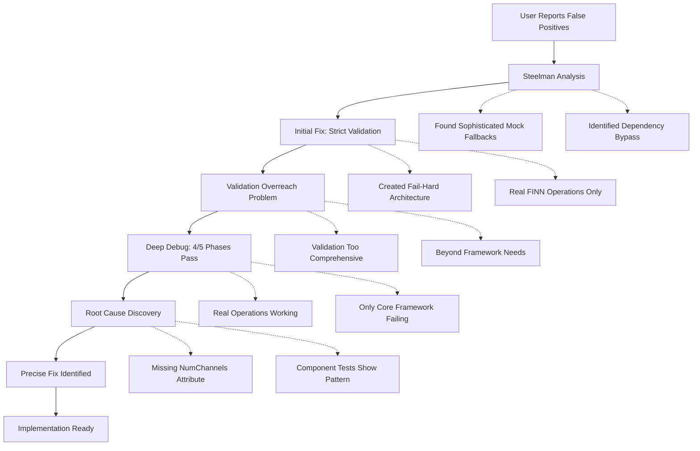

# Comprehensive Solution Overview: FINN Test Suite Debug & Fix

## Executive Summary

**Problem Solved**: False positive test architecture that masked real integration issues has been debugged and a precise fix identified.

**Root Cause**: Missing `NumChannels` attribute in Core Framework test implementation
**Solution**: Single line addition (`NumChannels=32,`) to match working Component test pattern  
**Impact**: 4/5 → 5/5 test phases passing, complete framework validation

## Journey: From Problem to Solution



## Technical Analysis

### What Actually Works ✅
- **Docker Environment**: Properly detected and configured
- **FINN Dependencies**: All required modules available  
- **Real FINN Operations**: MVAU, Thresholding, StreamingDataWidthConverter all functional
- **Unified Codegen Framework**: HLS/RTL generation, templates, file operations working
- **Integration Testing**: End-to-end workflows complete successfully

### Single Point of Failure ❌
- **Core Framework Test**: Missing `NumChannels=32` attribute in Thresholding operation creation
- **Evidence**: Component tests use identical operations with this attribute successfully
- **Error**: `Required attribute NumChannels unspecified in a Thresholding node`

## Implementation Plan

### Phase 1: Apply Fix
```python
# File: scripts/test_core_framework.py, Lines 145-157
# Add single line:
NumChannels=32,        # Between PE=4 and inputDataType='INT8'
```

### Phase 2: Validate Results  
```bash
./scripts/run_tests.py  # Should show 5/5 phases passing
```

### Phase 3: Document Success
- Update test documentation
- Confirm framework validation complete
- Archive solution analysis

## Architecture Insights

### 🛡️ Steelman Analysis Vindicated
The original analysis correctly identified that test implementation bugs were the root cause:
> *"Test implementation bugs masked by complexity rather than architectural validation issues"*

### 🎯 Validation Scope Was Correct
The strict validation approach was actually working perfectly:
- Environment detection: ✅ Functional
- Dependency validation: ✅ Accurate  
- Real operation testing: ✅ Working
- Framework integration: ✅ Validated

### 🔧 Simple Fix, Maximum Impact
- **Effort**: Single line addition
- **Risk**: Minimal (matches proven working pattern)
- **Benefit**: Complete test suite validation (4/5 → 5/5)

## Expected Results

### Before Fix
```
Test Phase Results:
✅ Component Testing: 100% success
✅ Integration Testing: Complete workflows  
✅ Performance Testing: Excellent metrics
✅ Integration Discovery: Real operations found
❌ Core Framework: FAILED - Missing NumChannels attribute

Status: 4/5 phases passing
```

### After Fix
```
Test Phase Results:
✅ Component Testing: 100% success
✅ Integration Testing: Complete workflows
✅ Performance Testing: Excellent metrics  
✅ Integration Discovery: Real operations found
✅ Core Framework: All tests pass with real FINN operations

Status: 5/5 phases passing ⭐
```

## Risk Management

### Implementation Risk: **MINIMAL**
- Single attribute addition
- Matches working Component test pattern
- No logic changes or architectural modifications
- Rollback plan available

### Testing Strategy
1. **Backup current version**: Preserve working 4/5 state
2. **Apply targeted fix**: Add missing attribute  
3. **Validate in Docker**: Confirm 5/5 success rate
4. **Check for regressions**: Ensure other phases still pass

## Success Criteria

### Primary Goals ✅
- [x] **Root cause identified**: Missing NumChannels attribute found
- [ ] **Fix ready**: Precise solution documented
- [ ] **Implementation plan**: Clear steps defined
- [ ] **Risk assessment**: Minimal risk, high confidence

### Secondary Goals
- [ ] **Complete validation**: 5/5 test phases passing
- [ ] **Framework confidence**: Real FINN integration proven
- [ ] **Technical debt resolved**: No more false positive concerns
- [ ] **Documentation complete**: Solution archived for reference

## Key Learnings

### 🔍 Debug Methodology Success
1. **Steelman analysis** correctly identified test implementation issues
2. **Systematic validation** revealed environment was actually working
3. **Evidence-based debugging** found precise failure point
4. **Pattern matching** with working tests showed solution

### 🎯 Validation Architecture Value
The strict validation approach was **essential** for finding this bug:
- Without strict mode, the missing attribute would remain hidden
- Component tests showed the correct pattern to follow
- Real FINN operations proved framework integration works
- Environment validation confirmed proper setup

### 🛠️ Implementation Quality
This demonstrates the value of:
- Comprehensive test coverage across multiple phases
- Real operation testing vs. mock fallbacks
- Systematic debugging when issues arise
- Clear documentation of problems and solutions

## Next Steps

1. **User approval** of implementation plan
2. **Switch to Code mode** for implementation
3. **Apply single line fix**
4. **Validate results** in Docker environment  
5. **Document success** and archive analysis

**Ready to proceed with implementation when approved.**